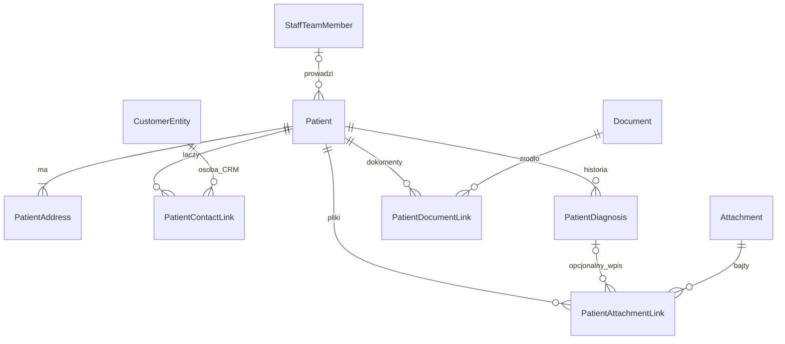

# Patient — kartoteka i dokumentacja pacjenta

**Date**: 2026-09-29  
**Status**: Draft  
**Spec ID**: PAT  
**Zakres**: projekt, bez implementacji i zmian bazy. Wersja kompletna do przeglądu.  
**Powiązana specyfikacja**: [Wizyty](2026-09-29-patient-visits.md), ten sam moduł `patient`.

## TLDR

Moduł `patient` przechowuje własną kartotekę pacjenta, jego adresy, relacje z osobami CRM, diagnozy oraz powiązania z dokumentami i plikami. Pacjent nie musi być osobą CRM; opiekunowie, kontakty i płatnicy pozostają w CRM. Współdzielony edytor adresów pochodzi z mechanizmu używanego przez CRM; dokumenty i bajty plików nadal należą do swoich modułów.

Użytkownik zatwierdził 2026-09-29 **dwa dokumenty specyfikacji w jednym module** oraz **0..n usług na wizytę**. Ten dokument obejmuje kartotekę i jej dokumentację; drugi dodaje wizyty. Warunek wdrożenia plików klinicznych **SEC-ATT** opisany poniżej wynika z rzeczywiście sprawdzonego ograniczenia zainstalowanego frameworka.

## Problem Statement

W Polanie Przygody pacjentem może być dziecko, a osobami kontaktowymi i płatnikami jego opiekunowie. Rekord CRM nie jest dokumentacją medyczną. Potrzebny jest niezależny pacjent, wiele kontaktów, własny adres i dane kontaktowe oraz dostęp do diagnoz, dokumentów i załączników z jednej karty.

Źródła wymagań: brief użytkownika, decyzje Q1/Q2 oraz [oryginalny diagram](assets/patient-ehr-domain-input.png). Diagram dodaje opcjonalnego prowadzącego pacjenta. `assessment` interpretujemy jako opisową diagnozę/ocenę pacjenta; nie wprowadzamy odrębnego silnika kwestionariuszy. Kod modułu docelowo wyłącznie w `src/modules/patient/`.

## Overview and Success Measures

- **Wynik:** operator tworzy pacjenta z adresem i kontaktem, zapisuje, odczytuje ponownie i widzi wszystkie powiązania. Lekarz/terapeuta dodaje diagnozę i dokumentację z karty.
- **Mierniki akceptacji:** 100% scenariuszy PAT-T01–PAT-T12 przechodzi; zero odczytów obcego zakresu; ponowienie żądania nie duplikuje wpisu; utworzenie diagnozy z karty wymaga najwyżej trzech akcji nawigacyjnych, poza wpisywaniem danych.
- **Baseline:** modułu `patient` nie ma w aplikacji; mierzymy poprawność scenariuszy, nie deklarujemy niezmierzonych oszczędności czasu.
- **Badanie produktów, 2026-09-29:** [OpenMRS Patient](https://github.com/openmrs/openmrs-core/blob/master/api/src/main/java/org/openmrs/Patient.java), [Diagnosis](https://github.com/openmrs/openmrs-core/blob/master/api/src/main/java/org/openmrs/Diagnosis.java), [Visit](https://github.com/openmrs/openmrs-core/blob/master/api/src/main/java/org/openmrs/Visit.java) rozdzielają pacjenta, diagnozę i wizytę; diagnoza dopuszcza reprezentację kodowaną lub opisową. Przyjmujemy te granice, nie cały model encounter/concept/condition. [OpenEMR README](https://github.com/openemr/openemr/blob/master/README.md) opisuje razem EHR, planowanie i billing; w bazowej wersji billing ograniczamy do ręcznego znacznika w specyfikacji VIS. Sprawdzono źródła GitHub; witryny dokumentacyjne zwracały 404/403/502, więc nie stanowią dowodu. Nie deklarujemy zgodności FHIR ani zgodności regulacyjnej na podstawie tego porównania.

## Goals

| ID | Wynik |
|---|---|
| PAT-R01 | Utworzenie/edycja/archiwizacja pacjenta z własnym kontaktem i adresem oraz opcjonalnym prowadzącym |
| PAT-R02 | 0..n relacji z osobami CRM, w tym opiekun, kontakt i płatnik |
| PAT-R03 | Custom fields pacjenta: zapis, ponowny odczyt, edycja i wyczyszczenie |
| PAT-R04 | Wiele diagnoz z opisem i załącznikami; korekta bez utraty wcześniejszego wpisu |
| PAT-R05 | Przypięcie istniejącego dokumentu i utworzenie nowego z karty |
| PAT-R06 | Przypięcie pliku i upload z karty pacjenta lub diagnozy |
| PAT-R07 | Zakres tenant/organizacja, kontrola dostępu, szyfrowanie danych własnych, współbieżność i audyt |

## Non-goals

Recepty, wyniki laboratoryjne, alergie, leki, hospitalizacja, zgody prawne, PESEL jako identyfikator, P1/NFZ, ICD jako obowiązkowy słownik, FHIR, portal, AI, OCR treści klinicznej, powiadomienia i automatyczna retencja. Wizyty są opisane osobno. Relacja „opiekun” nie stanowi dowodu prawa do reprezentacji ani dostępu do dokumentacji. Nie kopiujemy CRM, edytora dokumentów ani storage.

## Proposed Solution

Jedna kartoteka w `patient`; kontakt CRM jest zewnętrzną referencją, a dokument i plik zasobem należącym do jego modułu. Dane identyfikujące i kliniczne nie trafiają do CRM. Model poniżej jest punktem wyjścia dla API, ekranów i faz.

### Design Decisions and Alternatives

| Decyzja | Uzasadnienie | Alternatywa / powód odrzucenia |
|---|---|---|
| Własny `Patient` | Pacjent może mieć zero osób CRM | Wymuszenie osoby CRM na każdego pacjenta miesza kartotekę z CRM |
| `PatientAddress` + wspólne `AddressesSection` | CRM ma FK do `CustomerEntity`; wspólne UI ma `AddressDataAdapter` | Użycie ID pacjenta w `/api/customers/addresses` narusza kontrakt |
| `PatientContactLink.customer_entity_id` | CRM API operuje na `CustomerEntity` typu `person`; profil `customer_people` ma własne ID | Niejednoznaczne `person_id` grozi pomyleniem obu UUID |
| Własny `PatientDocumentLink` | `DocumentEntityLink` ma zamknięty enum bez `patient` | Rozszerzenie enumu w `node_modules` jest niedozwolone |
| Diagnozy opisowe, korekty jako nowe wpisy | Historia medyczna nie znika przy poprawce | Nadpisanie opisu gubi wcześniejszą treść |
| Opcjonalny kod diagnozy z systemem i wersją | Pozwala zapisać kod bez wdrażania terminologii | Własny obowiązkowy słownik ICD rozszerza brief |
| Dokument zachowuje ACL właściciela i shares | Przypięcie nie jest nadaniem dostępu | Automatyczne udostępnienie całej organizacji ujawnia dokument |
| Pliki kliniczne dopiero po SEC-ATT | Prywatna partycja chroni dziś tylko zakres | Nowy endpoint pacjenta bez ochrony starego URL jest obejściem pozornym |

## Domain Vocabulary and Business Rules

1. Pacjent należy do jednego tenanta i jednej organizacji. Nie ma globalnych pacjentów; transfer między organizacjami nie należy do MVP.
2. `first_name` i `last_name` są wymagane; `birth_date` opcjonalne, nie w przyszłości. Brak wymogu unikalności nazwiska, e-maila czy daty urodzenia. Pacjent ma co najmniej jeden własny kanał kontaktu: e-mail lub telefon, oraz co najmniej jeden aktywny adres. Dla dziecka można świadomie wpisać wspólny kontakt rodzica; nie pobieramy go dynamicznie zamiast danych pacjenta.
3. Tworzenie pacjenta i pierwszego adresu jest atomowe. Pierwszy adres jest główny; aktywny pacjent ma dokładnie jeden główny adres. Zmiana głównego adresu blokuje agregat pacjenta i przełącza oba wpisy atomowo. Usunięcie ostatniego adresu aktywnego pacjenta daje 409.
4. Pacjent może mieć zero kontaktów CRM. Ta sama osoba może być powiązana z wieloma pacjentami. Jedno aktywne powiązanie danej pary; role są niezależnymi flagami, można łączyć płatnika i opiekuna. Co najmniej jedna flaga roli; `is_primary_contact` wymaga `is_contact`. Najwyżej jeden główny kontakt na pacjenta, ale nie musi istnieć.
5. Prowadzący pacjenta jest opcjonalny; nie stanowi autoryzacji i nie zastępuje wymaganego wykonawcy wizyty. Referencje sprawdzamy w tym samym zakresie i tylko do aktywnych rekordów. Dotychczasowe, później nieaktywne referencje nadal są widoczne jako historyczne; nie wybiera się ich ponownie.
6. Diagnoza ma tytuł, opis, datę i autora z uwierzytelnienia. Treść po zapisie jest niezmienna. Korekta tworzy nowy wpis `supersedes_id`, unieważnienie wymaga powodu; historia pozostaje dostępna. Pacjent może mieć wiele równoległych diagnoz, bez wymogu wizyty.
7. Archiwizacja pacjenta blokuje nowe wpisy, ale zachowuje odczyt historii. Korekta/unieważnienie diagnozy jest nadal dozwolone z uprawnieniem klinicznym. Błędną, pustą kartę można usunąć miękko, jeśli nie ma diagnoz, dokumentów, plików ani wizyt; zwykłe usunięcie nie zastępuje retencji. Wizyty dodają warunek przez własną fazę VIS-1.
8. Odpięcie dokumentu/pliku usuwa relację, nie zasób u właściciela. Nie kaskadujemy do CRM, staff, dokumentów ani storage. Każde odpięcie jest wersjonowane i audytowane.

## Users, Permissions, and Scope

| Aktor funkcjonalny | Feature IDs | Granica |
|---|---|---|
| Rejestracja | `patient.patients.view`, `patient.patients.manage` | Dane kartoteki, adresy, kontakty; bez diagnoz i plików klinicznych |
| Osoba kliniczna | dodatkowo `patient.clinical.view`, `patient.clinical.manage` | Diagnozy, powiązania dokumentacji i plików |
| Administrator konfiguracji | `patient.configure` | Definicje pól i konfiguracja; nie jest automatycznym prawem do dokumentacji |

`manage` zależy od odpowiadającego `view`; `clinical.view` zależy od `patients.view`. Feature IDs, nie nazwy ról, sterują serwerem i UI. Dostęp do dokumentu wymaga ponadto własnych uprawnień `documents.view` oraz tieru viewer/editor/owner; utworzenie wymaga `documents.create`. Nadania `documents.manage` mają szerokie znaczenie w zainstalowanym module i nie są automatycznie przydzielane klinicystom.

Zakres z sesji/API key i wybranej dozwolonej organizacji przez standardowy kontekst request/command. Pola scope w payloadzie odrzucamy. Brak tenanta lub konkretnej organizacji = odmowa, nie „wszystkie”. `created_by_user_id` i autor diagnozy są serwerowe. Setup nie nadaje `patient.*` wszystkim zalogowanym; dodaje deklaracje i jawny zestaw dla administratora zgodnie z konfiguracją aplikacji. Nie modyfikuje po cichu istniejących ról.

## Reuse and Ownership Map

Sprawdzony **installed-version: `0.8.1-develop.7266.1.8e520bbe03`**, zgodny z `package.json`, resolverem i stemplami facts. `@open-mercato/documents` nie dostarcza własnego `AGENTS.md`; obowiązuje hierarchia aplikacji/upstream. Nie wykryto rozjazdu wersji.

| Zdolność | Właściciel / dokładny kontrakt | Użycie w `patient` |
|---|---|---|
| Osoba CRM | `customers:customer_entity` + `customers:customer_person_profile`, `data/entities.ts` | Scalar `customer_entity_id`, walidacja `kind=person` |
| Adres | CRM `components/detail/AddressesSection.tsx` używa `@open-mercato/ui/backend/detail` → `AddressesSection`, `AddressDataAdapter`, `AddressTypesAdapter` | Ten sam komponent i format adresu, adapter do API pacjenta |
| Dokument | `documents:document`, `api/route.ts`, `commands/document-crud.ts` → `documents.document.create` | Link aplikacyjny; odczyt/edycja/wersje w natywnym edytorze |
| ACL dokumentu | `documents/lib/permissions.ts` | Owner/shares/tier, brak automatycznego share z linku |
| Link natywny | `documents/data/validators.ts` → `documentEntityTypeSchema` | Nie używamy dla `patient`; enum ma 8 innych wartości |
| Upload/bajty | Publiczny `AttachmentService` z `@open-mercato/core/modules/attachments`, DI `attachmentService` | `readUploadForm`, `createScoped` z `persistLink`, `readScoped`, `releaseScoped` tylko dla własnych zasobów |
| Custom fields | `entities`, wzorzec `src/modules/example/ce.ts`, `commands/todos.ts` | `patient:patient`, standardowa normalizacja i Data Engine |
| Prowadzący | `staff:staff_team_member` | ID członka zespołu, nie ID użytkownika |

Źródła frameworka znajdują się pod `node_modules/@open-mercato/core/src/modules/` i `node_modules/@open-mercato/documents/src/modules/documents/`; służą wyłącznie jako dowód. Źródło UI karty: `customers/backend/customers/people/[id]/page.tsx`; źródło formularza: `src/modules/example/components/TodoForm.tsx` i strony create/edit. Moduł `example` jest referencją nieaktywną — nie włączamy go w celu realizacji tej specyfikacji.

## Architecture and Data Flow

```text
Karta pacjenta → API patient → komenda + scope/version → tabele patient → commit → zdarzenie
Adres → wspólne AddressesSection → PatientAddressDataAdapter → komenda adresu
Nowy dokument → trwały intent/link patient → documents.document.create → aktywacja linku → edytor documents
Upload → attachmentService.readUploadForm/createScoped(persistLink) → link + Attachment → storage
Pobranie → autoryzacja właściciela (SEC-ATT) → attachmentService.readScoped
```

App-owned DI `patientReferenceService` rozwiązuje scoped referencje i wyświetlane nazwy, bez ORM relacji między modułami. Odczyty przez właścicielskie API/usługi lub dozwolone scalar reads z odszyfrowaniem; mutacje zawsze przez komendy właściciela. Attachments wyłącznie przez publiczny serwis — bez czytania jego ORM przez `patient`.

**Dokument — bez pozornej transakcji rozproszonej:** `PatientDocumentLink` ma stan `pending_create`, zawiera wygenerowane przez serwer `document_id`, `content_id` i zaszyfrowany tytuł intencji. Pierwsza transakcja zapisuje intent i `client_request_id`; następnie komenda właściciela tworzy dokument z tymi ID. Po jej sukcesie druga transakcja aktywuje link. Powtórzenie autoryzuje ponownie i wznawia ten sam intent; jeśli dokument istnieje, sprawdza zakres, autora i ID, nie tworzy nowego. Przy niepewnym wyniku UI pokazuje „Dokończ przypisanie”, bez automatycznego tworzenia drugiego dokumentu. Intent blokuje usunięcie pacjenta. Nie otaczamy komendy documents zewnętrzną transakcją: jej własne zdarzenia są post-write, lecz nie czekają na commit dowolnej transakcji wywołującej. Niedokończony intent można porzucić z audytem; istniejący dokument pozostaje dostępny u właściciela, nigdy nie jest kasowany automatycznie.

Zmiany są addytywne: nowe tabele, ID `patient:*`, feature IDs i trasy; żadnych zmian istniejących URL, enumów, DI czy schematów hostów. Obowiązuje `.ai/guides/upstream/BACKWARD_COMPATIBILITY.md`.

## User Journeys

- **PAT-J1:** Pacjenci → Dodaj → imię/nazwisko, kontakt i pierwszy adres → zapis atomowy → karta. Błąd walidacji zachowuje dane, brak scope odmawia zapisu, ponowienie tego samego `client_request_id` zwraca ten sam rekord.
- **PAT-J2:** Karta → Kontakty → wybór osoby CRM po nazwie → role → zapis. Użytkownik może odpiąć kontakt, a jego rekord CRM pozostaje. Wyczyszczenie prowadzącego zapisuje `null`.
- **PAT-J3:** Karta → Diagnozy → Dodaj → tytuł/opis/data → zapis → pliki wpisu. Nieudany upload nie usuwa diagnozy; można ponowić upload. „Skoryguj” zachowuje poprzednią wersję; 409 odświeża wersję bez utraty formularza.
- **PAT-J4:** Dokumenty → Przypnij istniejący lub Nowy → po sukcesie natywny edytor. Brak praw nie ujawnia tytułu ani treści. Przerwane tworzenie ma widoczny stan intencji i możliwość wznowienia.
- **PAT-J5:** Pliki → Wgraj/Przypnij → zapis w prywatnej partycji → podgląd/pobranie przez autoryzowaną ścieżkę. 413/quota/błąd storage ma osobny komunikat; wpis nie wygląda jak gotowy plik po nieudanym uploadzie.

## UI and Interaction Contracts

| Powierzchnia | Dane / zapis | Wzorzec i komponenty | Wymagania |
|---|---|---|---|
| `/backend/patient/patients` | `GET /api/patient/patients`, filtry status/ID, wyszukiwanie dokładne | CRM people list; `Page`, `PageBody`, `DataTable`, `RowActions` | PAT-R01/07 |
| `/backend/patient/patients/create` | `POST /api/patient/patients` + pierwszy adres | Example todo create; `CrudForm`, wspólne pola adresu | PAT-R01/03 |
| `/backend/patient/patients/[id]` | Pacjent, adresy/kontakty, diagnozy, linki | CRM people detail; `CrudForm`, `AddressesSection`, `DataTable` w zakładkach | Wszystkie PAT |
| Natywne `/backend/documents/[id]` | API właściciela dokumentu | Istniejący edytor dokumentów; otwierany z karty | PAT-R05 |

```text
Pacjenci                                      [Dodaj pacjenta]
[Status] [Wyszukaj po numerze / dokładnych danych]
Numer | Imię i nazwisko | Kontakt | Prowadzący | Status | Akcje

Pacjent: imię nazwisko / numer                [Zapisz] [Archiwizuj]
Dane i pola dodatkowe | Adresy | Kontakty | Diagnozy | Dokumenty | Pliki
[Dane kontaktowe] [Opis] [Prowadzący ▼] [Custom fields]
Adresy: wspólny edytor CRM, oznaczenie adresu głównego
Diagnozy: data | tytuł | autor | stan | [Zobacz] [Skoryguj]
Dokumenty: tytuł | stan przypisania | [Otwórz] [Odepnij] [+ Nowy]
```

Menu „Pacjenci” w grupie opieki; create/detail ukryte w nawigacji, wejście przez listę. Bez osobnego dashboardu. Selektory pokazują nazwy, nigdy UUID. Źródła opcji: `GET /api/customers/people` i `GET /api/staff/team-members` (źródło `staff/api/team-members.ts`), mapowanie ID sprawdzone dodatkowo w testach; selektor dokumentów korzysta z `GET /api/documents` z natywnym filtrem widoczności. Brak uprawnienia hosta blokuje selektor zamiast zwracać pełną listę. `PatientReferenceService` normalizuje opcje, nie daje szerszego dostępu niż API hosta.

API przez `apiCall`/`apiCallOrThrow`, CRUD przez `createCrud`/`updateCrud`/`deleteCrud`; niestandardowe akcje przez `useGuardedMutation`, nagłówek wersji i `surfaceRecordConflict`. DataTable ma `entityId=patient:patient`, `extensionTableId=patient.patients.list`; formularz `crud-form:patient.patient`. Odczyt custom fields i zapis używają tej samej tożsamości `patient:patient`.

Każda strona/sekcja ma loading, empty z następną akcją, błąd z retry, brak praw, 404, walidację, sukces i 409. Błąd podsekcji nie usuwa karty. Przy 409 zachowujemy wpisane dane i oferujemy odczyt aktualnej wersji, bez cichego nadpisania. Klawiatura: logiczny focus, etykiety, Escape, Cmd/Ctrl+Enter w dialogu, powrót fokusu do przycisku. Komunikaty aria-live. Na 360 px grupy układają się pionowo, tabela korzysta ze wspieranego przewijania, dialog mieści się w viewport. Semantyczne tokeny, `StatusBadge`, light/dark i reduced motion; teksty `patient.*` w pl/en, bez hardkodowanych kolorów. Implementacja UI wymaga `om-backend-ui-design` i `.ai/guides/backend-ui.md`.

## Data Models

Wszystkie nowe encje w `src/modules/patient/data/entities.ts`. Typy poniżej opisują DB; API używa camelCase. UUID rekordów z innych modułów są scalarami bez cross-module FK/ORM relation. Wewnątrz `patient` FK mogą używać `(tenant_id, organization_id, id)`; warunki zakresu obowiązują także komendy. Żadnego cascade hard-delete danych klinicznych.



**Kolumny wspólne:** `id uuid PK`; `tenant_id`, `organization_id uuid NOT NULL`; `created_at`, `updated_at timestamptz NOT NULL`; `created_by_user_id`, `updated_by_user_id uuid NOT NULL` ze staff auth; `deleted_at timestamptz NULL`. `updated_at` rośnie monotonicznie nawet przy dwóch zapisach w tej samej milisekundzie. Indeks każdej tabeli zaczyna się od `(tenant_id, organization_id)`; mutacje wyszukują także rodzica i `deleted_at IS NULL`. Usuwanie klinicznego wpisu oznacza unieważnienie, nie ustawienie `deleted_at` w zwykłym UI.

### Patient — `patient_patients`, entity ID `patient:patient`

| Pole | Typ / null | Indeks / ochrona | Reguła |
|---|---|---|---|
| `patient_number` | text, wymagane | unique w scope; niekliniczny identyfikator | Serwer, niezmienny, nie PESEL; format `P-<UUID>` bez numerowania wymagającego globalnego licznika |
| `first_name`, `last_name` | text, wymagane | szyfrowane, tokeny dokładnego wyszukania | 1–120 znaków każda |
| `birth_date` | text, opcjonalne; domenowo data ISO | PII; szyfrowana reprezentacja zgodna z mapą, bez sortowania ciphertext | Nie w przyszłości; implementacja mapuje do tekstu ISO w szyfrowanym storage, nie SQL date ciphertext |
| `email`, `phone` | text, opcjonalne | szyfrowane; hashowane indeksy dokładnego dopasowania | Co najmniej jedno; email poprawny, telefon zachowuje prefiks kraju |
| `description` | text, opcjonalne | szyfrowane, bez indeksowania treści | Do 20 000 znaków; nie zastępuje diagnozy |
| `owner_team_member_id` | uuid, opcjonalne | scalar staff; indeks scope+owner | Aktywny członek tej organizacji |
| `status` | text, wymagane | indeks scope+status+created_at | `active` / `archived`, domyślnie active |
| `archived_at` | timestamptz, opcjonalne | audit | Ustawiane/zerowane z przejściem statusu |
| `client_request_id` | uuid, wymagane przy create | unique scope+request | Ponowienie create bez duplikatu |

Fizyczne pole `birth_date` jest `text NULL` przechowującym szyfrowaną datę ISO; nigdy nie zapisujemy ciphertext do kolumny SQL date. Datę waliduje schema API. Nie dodajemy tabeli własnych custom fields — korzystamy z `entities`.

### PatientContactLink — `patient_contact_links`

`patient_id uuid NOT NULL`; `customer_entity_id uuid NOT NULL` wskazuje `CustomerEntity(kind=person)`; `is_guardian`, `is_contact`, `is_payer boolean NOT NULL default false`; `is_primary_contact boolean NOT NULL default false`; `relationship_label text NULL` (szyfrowane, ≤120); wspólne kolumny. Partial unique aktywnej pary `(scope, patient_id, customer_entity_id)` i aktywnego głównego kontaktu `(scope, patient_id) WHERE is_primary_contact AND deleted_at IS NULL`. `CHECK` co najmniej jednej roli i `NOT is_primary_contact OR is_contact`. Nie przechowujemy salda ani danych płatności. Zmiana danych osoby w CRM jest widoczna przy kolejnym odczycie; nie kopiujemy telefonu do linku.

### PatientAddress — `patient_addresses`

`patient_id uuid NOT NULL`; `name`, `purpose`, `company_name`, `address_line2`, `city`, `region`, `postal_code`, `country`, `building_number`, `flat_number text NULL`; `address_line1 text NOT NULL`; `latitude`, `longitude` opcjonalne; `is_primary boolean default false`; wspólne kolumny. Kontrakt wspólnego edytora CRM, `country` ISO-3166 alpha-2 uppercase; dla pierwszego adresu wymagamy także miasta i kraju, kod opcjonalny dla formatów bez kodu. Pola tekstowe adresu i współrzędne to dane wrażliwe: szyfrowana reprezentacja zgodna z mapą, współrzędne przechowywane jako nullable text i dekodowane do number w adapterze. Bez geokodowania.

Partial unique `(scope, patient_id) WHERE is_primary AND deleted_at IS NULL`; indeks scope+patient. Operacje zmieniające komplet/główny adres blokują pacjenta. Adres nie jest współdzielony z opiekunem przez referencję; kopiowanie danych kontaktu/adresu wymaga świadomej akcji, bez synchronizacji zwrotnej do CRM.

### PatientDiagnosis — `patient_diagnoses`

| Pole | Typ / null | Reguła / ochrona |
|---|---|---|
| `patient_id` | uuid, wymagane | FK w module, indeks scope+patient+diagnosed_on |
| `title`, `description` | text, wymagane | Szyfrowane; 1–250 i 1–50 000 znaków |
| `diagnosed_on` | date, wymagane | Data diagnozy ≤ lokalna bieżąca data organizacji; zakres medyczny |
| `code`, `code_system`, `code_version` | text, opcjonalne | Kod i system razem albo oba null; szyfrowane; wersja opcjonalna, brak walidacji słownikowej w MVP |
| `author_user_id` | uuid, wymagane | Serwer, nie `team_member_id` podsłany przez klienta |
| `supersedes_id` | uuid, opcjonalne | Starsza diagnoza tego pacjenta; partial unique aktywnego następcy; brak cykli |
| `status` | text, wymagane | `active`, `superseded`, `voided` |
| `void_reason` | text, opcjonalne | Szyfrowane, wymagane przy voided |
| `voided_at`, `voided_by_user_id` | timestamptz/uuid, opcjonalne | Serwer przy unieważnieniu |
| `client_request_id` | uuid, wymagane | Unique scope+request |

Korygować można wyłącznie aktywny, ostatni wpis łańcucha; starsze superseded/voided odmawiają 409. Korekta atomowo zapisuje nową diagnozę i ustawia poprzednią jako superseded z kontrolą jej wersji. Nie kasuje i nie przenosi automatycznie dawnych plików; można świadomie przypiąć je do nowej diagnozy. Opis daty/tytułu należy do wpisu, nie do pliku.

### PatientDocumentLink — `patient_document_links`

`patient_id`, `document_id uuid NOT NULL`; `state text` = `pending_create` / `linked` / `abandoned`; `content_id uuid NULL`, `creation_title text NULL` szyfrowane tylko dla intencji tworzenia; `client_request_id uuid NOT NULL`; wspólne kolumny. Unique aktywnej pary scope+patient+document i scope+client_request_id. Jeden dokument może być przypięty do kilku pacjentów tylko świadomie; ACL dokumentu pozostaje wspólne, UI ostrzega o współdzieleniu, a selektor nie ujawnia innych pacjentów. Wersji/treści dokumentu nie dublujemy. Po aktywacji usuwamy tymczasowy `creation_title`.

### PatientAttachmentLink — `patient_attachment_links`

`patient_id`, `attachment_id uuid NOT NULL`; `diagnosis_id uuid NULL`; `client_request_id uuid NOT NULL`; `state text` = `active` / `detached`; `original_file_name text NULL` szyfrowane do etykiety UI; wspólne kolumny. Dwa partial unique: scope+patient+attachment, gdy diagnosis null, oraz scope+diagnosis+attachment, gdy diagnosis not null, dla aktywnych linków. `diagnosis_id` musi należeć do `patient_id`. Indeks scope+attachment służy autoryzacji odwołań. Plik może należeć do pacjenta ogólnie albo wpisu diagnozy, a karta pokazuje oba z oznaczeniem źródła.

Nowy upload: właściciel Attachment `entityId=patient:patient_attachment_link`, `recordId=<link UUID>`, prywatna partycja `patient-clinical`; assignment wskazuje pacjenta lub diagnozę. Przypięcie istniejącego pliku dopuszcza wyłącznie plik już objęty ochroną SEC-ATT w tym zakresie. Zwykły plik z biblioteki wymaga utworzenia chronionej kopii przez serwis właściciela po sprawdzeniu źródłowego dostępu; nie „uodparniamy” starego publicznego URL samym nowym linkiem. Link zachowuje oryginalną nazwę; w storage używamy neutralnego identyfikatora bez nazwiska/diagnozy.

### Transakcje, indeksy i wyszukiwanie

Komendy `runCrudCommandWrite`/`withAtomicFlush`, bez efektów przed commit. Kontrolę wersji wykonujemy po blokadzie rodzica w tej samej transakcji; `expectedUpdatedAt` obowiązkowe dla zmiany/usunięcia istniejącego rekordu, brak = 400, niezgodność = 409. Encje obsługujące idempotentny create (Patient, Diagnosis, DocumentLink, AttachmentLink) mają również `create_request_payload text NOT NULL`, niezmienną zaszyfrowaną znormalizowaną treść pierwotnego requestu bez scope/aktorów/wersji; dla pliku zawiera metadane operacji i identyfikator uploadu, bez bajtów. Nie zwracamy tej kolumny w API ani logach. Retry create z tym samym scope/request i taką samą znormalizowaną treścią daje istniejący wynik; z inną treścią = 409. Nie należy wyprowadzać idempotencji z imienia czy telefonu.

`encryption.ts` deklaruje własne mapy; odczyty przez helpery decryption. Dokładne wyszukiwanie nazw/kanałów przez standardowe indeksy hashowane, bez SQL ILIKE/order po ciphertext. Lista sortuje po numerze/dacie/statusie; nie dodajemy globalnego fulltext/vector ani CSV z medyczną treścią. Pola custom nie są domyślnie kliniczne: sensitive fields muszą mieć wspieraną konfigurację ochrony; brak takiej konfiguracji blokuje zapis wrażliwych pól, nie oznacza zgody na jawny fallback.

## API, Command, and Error Contracts

Nowe trasy poniżej są projektem kontraktu. Każdy plik API ma per-method `metadata` i `openApi`; scope z kontekstu. Listy: `{items,totalCount,page,pageSize}`, pageSize 1–100; detail/create/update zwracają `id,updatedAt` i właściwe pola. PATCH nie jest osobnym drugim API; zmiany przez PUT z rozróżnieniem undefined i null.

| Metoda / ścieżka | Komenda / dane | Uprawnienia | Wynik |
|---|---|---|---|
| GET/POST/PUT/DELETE `/api/patient/patients` | `patient.patients.create/update/delete`; POST `{firstName,lastName,email?,phone?,birthDate?,description?,ownerTeamMemberId?,primaryAddress,customFields?,clientRequestId}`; PUT `{id,expectedUpdatedAt,...patch}` | patients.view/manage | 200/201; DELETE tylko pusta karta |
| GET/POST/PUT/DELETE `/api/patient/addresses` | `patient.addresses.create/update/delete`; `patientId`, standardowe pola AddressDataAdapter, wersja rekordu i pacjenta | patients.view/manage | Adres + aktualna wersja rodzica |
| GET/POST/PUT/DELETE `/api/patient/contacts` | `patient.contacts.create/update/delete`; `patientId,customerEntityId`, flagi ról, wersja | patients.view/manage + prawo widoczności osoby CRM | Link |
| GET/POST `/api/patient/diagnoses` | `patient.diagnoses.create`; `{patientId,title,description,diagnosedOn,code?,codeSystem?,codeVersion?,clientRequestId}` | clinical.view/manage | Wpis |
| POST `/api/patient/diagnoses/[id]/correct` i `/void` | `patient.diagnoses.correct/void`; expectedUpdatedAt; nowa treść lub reason | clinical.manage | Nowy wpis / unieważnienie |
| GET/POST/DELETE `/api/patient/document-links` | `patient.document_links.create/delete`; istniejący documentId, native read access, wersja linku przy odpięciu | clinical.view/manage + native documents ACL | Link, bez przecieku tytułów |
| POST `/api/patient/document-links/new` i `/[id]/resume` | `patient.document_links.create_document/resume`; title, patientId, requestId / wersja intencji | clinical.manage + documents.create | 201 linked lub 202 pending z linkId |
| GET/POST/DELETE `/api/patient/attachment-links` | `patient.attachment_links.create/delete`; patientId, diagnosisId?, attachmentId, requestId; detach z wersją | clinical.view/manage + SEC-ATT | Chroniony link |
| POST `/api/patient/attachment-links/upload` | Bounded multipart przez attachmentService; link przez `persistLink` | clinical.manage + SEC-ATT | 201 z linkId, bez publicznego storage URL |
| GET `/api/patient/attachment-links/[id]/file` | Scope + link + SEC-ATT, `readScoped`, no-store | clinical.view | Bajty z bezpiecznymi nagłówkami |

CRUD przez `makeCrudRoute` z actions komend. Specjalne akcje przez guarded command routes, ten sam audit/context. GET diagnoz i linków zawsze z patientId; nic nie czyta treści klinicznej w ogólnym GET pacjentów. Błędy: 400 schema/brak wersji, 401 brak sesji, 403 feature, 404 rekord niewidoczny lub nieistniejący, 409 konflikt/niezmiennik, 413 rozmiar, 422 niedozwolony typ, 503 brak serwisu/storage/ochrony SEC-ATT. Mapować dokładne błędy quota serwisu, nie ponawiać ślepo mutacji po timeout.

## Events, Jobs, Notifications, and Cross-Module Flows

Nowe ID: `patient.patient.created/updated/archived/restored/deleted`, `patient.contact.created/updated/deleted`, `patient.address.created/updated/deleted`, `patient.diagnosis.created/corrected/voided`, `patient.document_link.created/updated/deleted`, `patient.attachment_link.created/deleted`. Payload wyłącznie `{id,tenantId,organizationId,patientId?,updatedAt}`; żadnych nazw, treści, kodów diagnoz czy nazw plików. Emisja po commit, jedna warstwa właścicielska, bez podwójnego emitowania przez route i command. Consumer nie jest potrzebny dla podstawowego zapisu.

Brak nowych kolejek/schedulerów. Niedokończone dokumenty wznawia jawna akcja; odzyskiwanie quota/upload pozostaje własnością attachments. Standardowe CRUD zdarzenia/indeksowanie własnych custom fields muszą zachować spójność przez Data Engine; test wyczyść/odczytaj chroni przed starym indeksem. Nie dodawać AI/search/notifications tylko dlatego, że istnieją w przykładzie.

## Security, Privacy, and Compliance

**SEC-ATT — obowiązkowy warunek przed PAT-3 i użyciem prawdziwych plików medycznych.** Sprawdzone `attachments/api/file/[id]/route.ts`, `api/image/[id]/[[...slug]]/route.ts` i `lib/access.ts` autoryzują zakres/partycję, lecz nie feature pacjenta ani jego rodzica. Zalogowany użytkownik tej organizacji może odczytać prywatny plik znając ID. Publiczny `AttachmentService` nie zamyka tych istniejących tras. Dispatcher `src/app/api/[...slug]/route.ts` wywołuje custom handler bez ogólnego API-interceptora, więc deklaracja w `patient/api/interceptors.ts` nie jest udowodnionym rozwiązaniem.

Wymagane dostarczenie wspieranego przez hosta, wywoływanego przed odczytem bajtów i metadanych kontraktu autoryzacji właściciela/partycji. Ma obejmować download, image/preview, library/list/detail, transfer/reassignment, delete, eksport oraz wejścia innych modułów, z odmową przy błędzie lub braku resolvera. Dla `patient-clinical` sprawdza aktualne `patient.clinical.view/manage`, zakres i żywy link/rodzica. Nie wolno omijać tej bramki przez publiczny storage URL lub pozostawienie kopii w ogólnej bibliotece. **To wymaganie hosta, nie istniejący API/DI token**: wdrożenie `patient` nie może wymyślić jego nazwy ani edytować `node_modules`; potrzebny jest osobno zatwierdzony upstream/upgrade. Do czasu jego dostępności PAT-3 pozostaje niewłączone, nie uznajemy MVP za wdrożone. Specyfikacja modelu nie zależy od nazwy przyszłego hooka.

Dokumenty mają własną politykę owner/shares; przypięcie nie zmienia tej polityki. Dostęp przez kartę wymaga obu uprawnień, bezpośredni edytor respektuje natywne ACL documents. To jawna semantyka współdzielenia: odebranie `patient.clinical.view` nie usuwa niezależnego share dokumentu; administrator musi zarządzać także share. UI komunikuje to przed przypięciem/udostępnieniem, nie obiecuje dziedziczenia ACL. Nie nadajemy shares w tle.

Własne dane szyfrujemy frameworkowo; brak klucza/config map dla wrażliwego zapisu = fail closed. Zainstalowana mapa documents obejmuje `label_snapshot`, nie całą zawartość dokumentu; nie deklarujemy field-level encryption Yjs/treści. Uruchomienie z realną dokumentacją wymaga zweryfikowanego szyfrowania storage/bazy i backupów, TLS oraz polityki dostępu do natywnego documents. Bez nowych providerów/credentiali w tej pracy.

Action log: identyfikator operacji/rekordu, aktor, czas i zakres; bez jawnych payloadów medycznych. Undo kartoteki/relacji wymaga chronionych snapshotów i sprawdzenia, że nowsza zmiana nie została nadpisana. Jeśli standardowy storage logu nie zapewnia ochrony treści, nie zapisujemy tam plaintext: ochronę snapshotów trzeba zapewnić przed włączeniem undo, nie wyłączać audytu. Diagnoza ma jawne correct/void zamiast destrukcyjnego undo. Brak automatycznego hard-delete/retencji, globalnego indeksu, OCR i eksportu klinicznego. Projekt nie ustala okresu retencji prawnej ani podstawy prawnej leczenia.

## Integration Coverage

Pliki docelowo `src/modules/patient/__integration__/PAT-Txx.spec.ts`. Każdy sam tworzy scope A/B, role/feature grants i potrzebne rekordy przez wspierane API/fixtures; sprząta wyłącznie swoje dane. Nie wymaga danych Polany ani kolejności uruchamiania testów.

| Test | Setup / akcja | Oracle | Wymagania |
|---|---|---|---|
| PAT-T01 | Nowy operator; create pacjenta+adres, reload, edycja, archive/restore, delete pustego | Atomowość, kontakt, numer, wersje, brak utajonej osoby CRM | R01/07 |
| PAT-T02 | Dwie osoby CRM i dwóch pacjentów; link/unlink, zmiana ról i primary | 0..n, unique, role niezależne, CRM nieusunięty | R02 |
| PAT-T03 | Dwa adresy; równoległe ustawienie głównego i usunięcie ostatniego | Jeden primary, 409, brak częściowej zmiany | R01/07 |
| PAT-T04 | Zdefiniowane custom fields; set/update/null/reload | Normalizacja, brak starej projekcji; szyfrowanie sensitive | R03 |
| PAT-T05 | Dwie role; create/correct/void diagnozy, równoległe korekty | Historia zachowana, autor serwerowy, jeden następca, 409, recepcja bez treści | R04/07 |
| PAT-T06 | Dokument własny, udostępniony i obcy; przypięcie/odpięcie | Native ACL, brak auto-share i przecieku tytułu | R05/07 |
| PAT-T07 | Awaria pomiędzy create dokumentu a aktywacją; resume/retry | Jeden dokument, jeden intent/link, widoczny pending, brak podwójnego eventu | R05 |
| PAT-T08 | Chroniony upload do pacjenta i diagnozy; błędny diagnosisId, timeout/quota | Jeden link+plik, prawidłowe źródło, brak linku po nieudanym uploadzie | R04/06 |
| PAT-T09 | Użytkownik tej samej organizacji bez clinical, inna organizacja, anonimowy; wszystkie bezpośrednie URL | SEC-ATT: brak bajtów, miniatur, nazw i metadanych; revoked grants skuteczne; host nonclinical bez regresji | R06/07 |
| PAT-T10 | Wszystkie mutacje z obcymi UUID/scope oraz brak/stara wersja | 400/403/404/409, zero zmian/eventów przy odmowie, brak logów PII | Wszystkie |
| PAT-T11 | Create/list/detail i dialogi przy loading/empty/error/409, 360 px, light/dark, klawiatura | Kanoniczne komponenty, zachowanie input/focus, brak UUID w UI | Wszystkie |
| PAT-T12 | Wyłączony documents/attachments/key, usunięty CRM/staff, niedokończony intent | Kontrolowana degradacja, żadnego fail-open, historyczne referencje czytelne | R01/02/05/06/07 |

## Implementation Phases

Wszystkie fazy pozostają **nieuruchomione**. Każda zawiera walidację, a nie późniejszą fazę „polish”. Implementacja ma ponownie routować odpowiednie umiejętności; ten dokument nie jest zgodą na migrację.

### PAT-1 — Działająca kartoteka

- **Depends on:** zatwierdzenie implementacji; brak zależności od VIS.
- **Outcome/value:** użytkownik zakłada kartę z adresem, relacjami CRM i custom fields.
- **Steps:** 1) Model Patient/Address/Contact, walidatory, szyfrowanie, ACL/setup i scoped SQL/snapshot. 2) Komendy, undo chronionych zmian, API i opcje CRM/staff. 3) Lista/create/karta, edytor adresów, kontakty i custom fields. 4) Domknięcie PAT-T01–04/10–12 i dokumentacji kontraktów.
- **Slices:** jedna spójna sekwencja ok. 3–4 commitów; schema i API/UI nie są niezależnymi modułami do równoległego budowania.
- **Requirements:** R01–R03/R07. **Validation:** `yarn db:generate` (review, bez apply); po plikach discovery `yarn generate`; unit komend i `yarn test:integration:ephemeral` z PAT-T01–04/10–12 w zatwierdzonym test-env.
- **Exit:** wszystkie wymienione oracle spełnione, round-trip/clear/409 i a11y/light/dark/narrow sprawdzone; pusta karta istnieje bez CRM.

### PAT-2 — Diagnozy i dokumenty

- **Depends on:** PAT-1, dostępny documents z właściwą polityką ACL/storage.
- **Outcome/value:** historia diagnoz i tworzenie/przypinanie dokumentów na karcie.
- **Steps:** 1) Diagnosis i DocumentLink/intent, migracja do przeglądu. 2) Komendy correct/void, link/create/resume, autoryzacja i testy awarii. 3) Zakładki/akcje i natywny edytor. 4) PAT-T05–07/10–12, decyzje operational security zapisane w protokole wdrożenia.
- **Slices:** diagnozy oraz dokumenty mogą mieć oddzielne zestawy plików po wspólnym schemacie, bez równoległych edycji `entities.ts`/ACL.
- **Requirements:** R04 (bez plików), R05/R07. **Validation:** generate, skupione unit, test-env PAT-T05–07/10–12.
- **Exit:** korekty nie niszczą historii, przerwane tworzenie dokumentu wznawia ten sam dokument; nie deklarujemy zamknięcia R04, dopóki PAT-3 nie dostarczy plików diagnozy.

### PAT-3 — Bezpieczne pliki pacjenta i diagnozy

- **Depends on:** PAT-2 oraz udowodnione **SEC-ATT** w wspieranej wersji hosta. Brak tej zdolności blokuje rozpoczęcie tej fazy.
- **Outcome/value:** upload, przypięcie, podgląd i odpięcie bez obejścia klinicznego ACL.
- **Steps:** 1) Zweryfikować wszystkie wejścia hosta testem PAT-T09 na syntetycznym fixture. 2) AttachmentLink/partycja/service integration, atomowy persistLink i retry. 3) UI plików obu miejsc z recoverable errors. 4) PAT-T08–12 i pełna walidacja.
- **Slices:** jedna sekwencja bezpieczeństwo → adapter/API → UI; bez osobnego storage providera.
- **Requirements:** R04/R06/R07. **Validation:** `yarn generate && yarn typecheck && yarn lint && yarn ds:check && yarn test && yarn build`; `yarn test:integration:ephemeral` dla pełnego PAT.
- **Exit:** również bezpośrednie download/image/library/transfer odmawiają dostępu, wszystkie PAT-AC spełnione; dopiero wtedy bazowa kartoteka jest wdrożona w pełnym zamówionym zakresie.

## Requirement Traceability

| Requirement | Journey/surface | Data/API | Phase | Tests | Acceptance |
|---|---|---|---|---|---|
| PAT-R01 | J1, lista/create/karta/adresy | Patient/Address, patients/addresses | PAT-1 | T01/T03/T10/T11/T12 | PAT-AC01 |
| PAT-R02 | J2, kontakty | ContactLink, contacts | PAT-1 | T02/T10/T11/T12 | PAT-AC02 |
| PAT-R03 | J1, pola | ce + Data Engine | PAT-1 | T04/T10/T11 | PAT-AC03 |
| PAT-R04 | J3, diagnozy/pliki | Diagnosis/AttachmentLink | PAT-2/3 | T05/T08/T09/T10/T11 | PAT-AC04 |
| PAT-R05 | J4, dokumenty | DocumentLink + documents command | PAT-2 | T06/T07/T10/T11/T12 | PAT-AC05 |
| PAT-R06 | J5, pliki | AttachmentLink + AttachmentService | PAT-3 | T08/T09/T10/T11/T12 | PAT-AC06 |
| PAT-R07 | Wszystkie | scope/ACL/encryption/version | Wszystkie | T01–T12 | PAT-AC07 |

Osobne powierzchnie discovery/runtime mają poniższe wzorce z `src/modules/example/references/surface-inventory.json`. Każdy test jest samowystarczalny; powtórzenie testu w kilku wierszach oznacza, że bada różne powiązane powierzchnie w tym samym scenariuszu. Wszystkie poniższe klasyfikacje to dokładnie **`emitted-example`**; pliki wzorcowe są nieaktywne, chyba że świadomie zarejestrowano example. Dla wymaganego przyszłego kontraktu SEC-ATT nie przypisujemy fikcyjnego capabilityId ani klasyfikacji — to zewnętrzny warunek, nie istniejący contribution aplikacji.

| Powierzchnia patient | Requirement | Capability ID | Dokładny wzorzec | Faza | Własny oracle |
|---|---|---|---|---|---|
| index/module registration | R01 | module.metadata | `src/modules/example/index.ts` | 1 | PAT-T01 |
| entities + migracje/snapshot | R01/02/04/05/06 | data.entities; data.migrations | `src/modules/example/data/entities.ts`; `src/modules/example/migrations/Migration20260804120546_example.ts` | 1/2/3 | PAT-T01/T05/T07/T08 |
| validators | R07 | data.validators | `src/modules/example/data/validators.ts` | 1/2/3 | PAT-T10 |
| encryption | R07 | data.encryption-map | `src/modules/example/encryption.ts` | 1/2/3 | PAT-T10 |
| ACL | R07 | module.acl-features | `src/modules/example/acl.ts` | 1/2/3 | PAT-T10 |
| setup/default grants/partycja | R03/06 | module.setup-role-features | `src/modules/example/setup.ts` | 1/3 | PAT-T04/T08 |
| ce/custom fields | R03 | data.custom-fields | `src/modules/example/ce.ts` | 1 | PAT-T04 |
| CRUD patient/address/contact | R01/02/03 | api.crud-query-engine-custom-fields | `src/modules/example/api/todos/route.ts` | 1 | PAT-T01/T02/T03/T04 |
| CRUD diagnosis/document/attachment links | R04/05/06 | api.crud-factory | `src/modules/example/api/customer-priorities/route.ts` | 2/3 | PAT-T05/T06/T08 |
| specjalne correct/void/new/resume/upload/file | R04/05/06 | api.custom-route | `src/modules/example/api/organizations/route.ts` | 2/3 | PAT-T05/T07/T08/T09 |
| OpenAPI wszystkich tras | R07 | api.openapi | `src/modules/example/api/openapi.ts` | 1/2/3 | PAT-T10 |
| komendy / undo | R01–07 | commands.write; commands.undo-redo | `src/modules/example/commands/todos.ts` | 1/2/3 | PAT-T01/T02/T03/T05/T07/T08 |
| patientReferenceService DI | R02/05 | module.di-registration | `src/modules/example/di.ts` | 1/2 | PAT-T02/T06 |
| events | R07 | events.typed-definitions | `src/modules/example/events.ts` | 1/2/3 | PAT-T10 |
| lista / DataTable host | R01 | ui.datatable | `src/modules/example/components/TodosTable.tsx` | 1 | PAT-T11 |
| page/meta/nav | R01 | ui.page-shell | `src/modules/example/backend/todos/page.meta.ts` | 1 | PAT-T11 |
| create/CrudForm host | R01/03 | ui.form-create | `src/modules/example/components/TodoForm.tsx` | 1 | PAT-T01/T04/T11 |
| karta/adresy/dialogi | R01–06 | ui.form-edit | `src/modules/example/backend/todos/[id]/edit/page.tsx` | 1/2/3 | PAT-T11 |
| deklaracje extension hostów | R01/03 | umes.extension-points | `src/modules/example/extension-points.ts` | 1 | PAT-T11 |
| pl/en | R01–06 | module.i18n-catalogs | `src/modules/example/i18n/pl.json` | 1/2/3 | PAT-T11 |

Przy implementacji rozbić wiersze zbiorcze na dokładne pliki tras/komend dostarczane w danej fazie; żaden nowy mechanizm poza tą listą nie może pojawić się bez własnego oracle i aktualizacji specyfikacji.

## Rollout, Migration, and Rollback

1. Dodać rejestrację `patient` dopiero wraz z kompletną PAT-1. Generować migracje `yarn db:generate`, sprawdzić wyłącznie tabele `patient_*` i snapshot; zgoda przed apply. Nie edytować shipped migrations ani `.mercato/generated`.
2. Przed realnymi danymi zainstalować encryption maps także dla istniejących tenantów wspieranym poleceniem frameworka, zweryfikować klucze i kontrolę dostępu. Żadnych przykładowych danych medycznych z rzeczywistych osób.
3. PAT-2 i PAT-3 włączać po ich exit gates; partycja prywatna i zero publicznych linków, SEC-ATT jest twardym warunkiem. Wszystkie smoke/integration wykonuje środowisko testowe, nie baza produkcyjna; nie migrować tylko w celu walidacji.
4. Rollback wyłącza nowe akcje/nav i zachowuje dane; nie uruchamia automatycznego DROP, nie usuwa dokumentów/bajtów. Czytanie historycznych danych musi pozostać możliwe dla uprawnionego operatora. Wyłączenie ochrony hosta z pozostawionymi plikami jest niedopuszczalne: przed downgrade trzeba zablokować udostępnianie tych plików.

## Risks and Tradeoffs

| Ryzyko | Skutek | Wykrycie / ograniczenie | Pozostaje |
|---|---|---|---|
| Ogólny URL załącznika omija ACL | Wyciek w ramach organizacji | SEC-ATT, PAT-T09 przed release | Wymagana zmiana/wspierana wersja hosta |
| Native document ACL niezależne od patient | Share działa także poza kartą | Wyraźna semantyka, brak auto-share, PAT-T06 | Konfiguracja shares jest obowiązkiem operatora |
| Treści documents bez mapy szyfrowania pól | Szerszy dostęp administratora DB/backup | Storage/backup encryption i native ACL przed danymi realnymi | Brak deklaracji end-to-end encryption |
| Współbieżna zmiana primary/korekta | Dwa główne adresy lub następcy | Blokada agregatu + partial unique + 409 | Operator rozstrzyga konflikt |
| Awaria create document / upload | Osierocony zasób lub duplikat | Intent, stałe ID/request, persistLink i recovery hosta | Pending widoczny do wznowienia |
| Usunięty rekord CRM/staff | Zerwana prezentacja | Brak kaskady, „niedostępny” bez UUID, test T12 | Nazwa może być niedostępna bez zachowanego snapshotu |
| Szyfrowane pola i wyszukiwanie | Niepoprawny ILIKE/sort | Indeksy frameworkowe, brak substring po ciphertext | W MVP wyszukiwanie dokładne |
| Logi/undo/custom fields | Druga jawna kopia PII | Chronione snapshoty, redakcja, test T10 | Konfiguracja kluczy i ról wymaga odbioru |

## Acceptance Criteria

- [ ] **PAT-AC01:** operator zapisuje i odczytuje kartę z kontaktem, adresem i opcjonalnym prowadzącym; jedna główna lokalizacja, poprawna archiwizacja i 409.
- [ ] **PAT-AC02:** pacjent działa z 0, 1 i wieloma osobami CRM; role można łączyć, odpięcie nie zmienia CRM.
- [ ] **PAT-AC03:** custom fields przechodzą set/edit/null/reload bez starej wartości i jawnego fallbacku sensitive.
- [ ] **PAT-AC04:** diagnozy zachowują datę/autora/opis/historię korekt i mają bezpieczne pliki.
- [ ] **PAT-AC05:** dokument istniejący można przypiąć, nowy utworzyć i wznowić po awarii bez duplikatu; brak auto-share.
- [ ] **PAT-AC06:** pliki karty i diagnozy można wgrać/przypiąć/pobrać/odpiąć; wszystkie ścieżki hosta przechodzą SEC-ATT.
- [ ] **PAT-AC07:** izolacja, szyfrowanie własnych danych, concurrency, audit oraz wszystkie UI states/light/dark/360 px/keyboard są sprawdzone w test-env; pełna walidacja przechodzi.

## Final Compliance Report

| Check | Status | Evidence / resolution |
|---|---|---|
| Applicable AGENTS/guides/skills | pass | spec-pr, om-spec-writing, template/spec-delivery; bounded framework-context, BC, backend-ui; installed-version wskazany |
| Model/API/UI/requirements consistent | pass — design | Pola, REQ/AC/testy i fazy powyżej; brak deklaracji wykonanych testów implementacji |
| End-to-end phases | pass — design | PAT-1, PAT-2, PAT-3 z konkretnymi bramkami; R04 domknięte dopiero w 3 |
| Platform reuse before custom code | pass — design | CRM shared addresses; documents owner; AttachmentService; zero zmian pakietów |
| UI references/primitives/states | pass — design | Tabela, makieta i PAT-T11 |
| Phase dependencies/tests/value | pass — design | Exit gates i testy w każdej fazie |
| Bezpieczny host plików | blocked for implementation | SEC-ATT brak w obecnej wersji; nie wdrażać PAT-3 |
| Zgoda na implementację | pending | Użytkownik zamówił specyfikację |

**Verdict:** Blocked — wdrożenie PAT-3 wymaga SEC-ATT; rozpoczęcie implementacji wymaga odrębnej zgody. Dokument projektowy jest kompletny do przeglądu, status Draft nie oznacza wdrożenia.

## Open Questions

Brak pytań blokujących model do użytkownika. Q1 rozstrzygnięte: dwa dokumenty / jeden moduł. Q2 rozstrzygnięte: 0..n usług wizyty. SEC-ATT i warunki operacyjne są jawnymi zależnościami wdrożenia, nie domniemaniem dostępności kontraktu.

## Changelog

| Date | Change |
|---|---|
| 2026-09-29 | Szkielet briefu i diagramu, Q1/Q2 |
| 2026-09-29 | Decyzje użytkownika; rozdzielenie PAT/VIS, model danych, sprawdzone kontrakty adresów/dokumentów/plików, SEC-ATT, plan i oracles |
