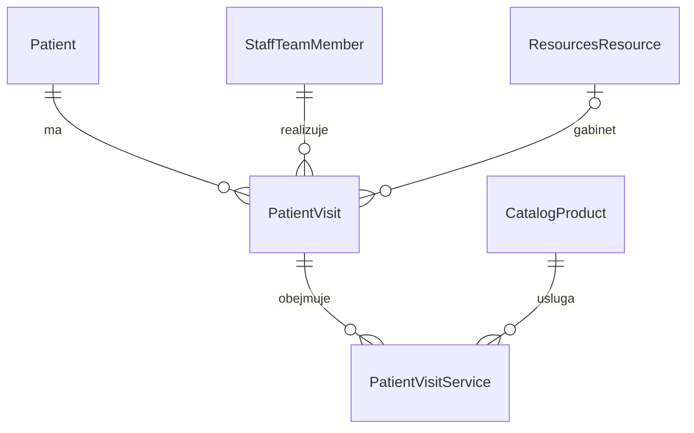

# Patient — wizyty pacjenta

**Date**: 2026-09-29
**Status**: Ready for implementation
**Spec ID**: VIS
**Zakres**: zatwierdzony do implementacji; VIS-1 i VIS-2 śledzone w ledgerze poniżej.
**Zależność**: [PAT — kartoteka i dokumentacja](2026-09-29-patient-ehr-base.md), faza PAT-1. Ten sam moduł `patient`.

## TLDR

Wizyta ma jednego pacjenta, obowiązkową osobę realizującą z `staff`, datę i opcjonalny gabinet z `resources`. Zgodnie z decyzją użytkownika wizyta ma **0..n usług z catalog**: można zapisać ją bez wybranej usługi i uzupełnić później. Opis, potwierdzenie i informacja o rozliczeniu są osobnymi danymi; rozliczenie jest ręcznym znacznikiem, bez płatności/faktury.

Wizyty można dostarczyć po PAT-1, niezależnie od klinicznych dokumentów i blokady SEC-ATT w PAT-3. To osobna specyfikacja zdolności tego samego modułu, nie drugi moduł i nie silnik rezerwacji.

## Problem Statement

Kartoteka pacjenta nie mówi, kiedy i u kogo pacjent ma wizytę, jakie usługi obejmuje ani czy plan został potwierdzony i rozliczony. Potrzebna jest lista i formularz wizyty, widoczne także z karty pacjenta. Usługi mogą zostać dobrane dopiero po zaplanowaniu terminu.

Źródło: brief, [diagram](assets/patient-ehr-domain-input.png), decyzja użytkownika 2026-09-29 „Usługi: Zero lub więcej”. Opcjonalny prowadzący pacjenta i obowiązkowy wykonawca wizyty są różnymi rolami.

## Overview and Success Measures

- **Primary outcome:** zapis i odczyt wizyty z 0, 1 i wieloma usługami, staff wymaganym i gabinetem opcjonalnym; osobne operacje potwierdzenia i oznaczenia rozliczenia.
- **Indicators:** wszystkie VIS-T01–VIS-T09 przechodzą, zero zdublowanych usług po retry, zero zmian po konflikcie wersji/obcym UUID.
- **Baseline:** brak własnego modułu wizyt w aplikacji. Celem nie jest jeszcze zmniejszenie konfliktów grafiku, bo silnik dostępności nie należy do tego zakresu.
- **Product reference:** sprawdzone 2026-09-29 [OpenMRS Visit](https://github.com/openmrs/openmrs-core/blob/master/api/src/main/java/org/openmrs/Visit.java) ma patient, location, start/stop i encounters. Bierzemy odrębny rekord wizyty i czas, pomijamy encounter jako dodatkowy poziom. [OpenEMR](https://github.com/openemr/openemr/blob/master/README.md) integruje scheduling i billing; tu zapis planu i ręczny znacznik nie udają tych pełnych mechanizmów. Badanie źródeł i ograniczenia dostępu do witryn opisuje PAT.

## Goals

| ID | Wynik |
|---|---|
| VIS-R01 | Zaplanowanie wizyty pacjenta z obowiązkowym staff, terminem, opcjonalnym gabinetem i opisem |
| VIS-R02 | 0..n usług z katalogu, dodanie/usunięcie bez duplikatów i utraty historycznej nazwy |
| VIS-R03 | Osobny cykl życia wizyty i potwierdzenie planu |
| VIS-R04 | Ręczne oznaczenie/cofnięcie rozliczenia z informacją kto i kiedy |
| VIS-R05 | Lista wizyt, karta/formularz i wejście z karty pacjenta, z czytelnymi nazwami referencji |
| VIS-R06 | Scoping, bezpieczna współbieżność, kontrola uprawnień, audyt i odtwarzanie stanu |

## Non-goals

Faktury, płatności, kwoty, ceny, waluty, rabaty, ubezpieczenia, podział płatności między opiekunów, sales order, automatyczna rezerwacja zasobów, konflikty grafiku, cykliczne wizyty, kalendarz drag-and-drop, wiele osób realizujących jedną wizytę, wiele gabinetów na wizytę, przypomnienia i portal. Brak auto-przenoszenia diagnoz lub dokumentów do wizyty. Zmiana terminu nie jest workflow z kolejką.

## Proposed Solution

`PatientVisit` jest agregatem, `PatientVisitService` jego listą usług. Zapis nagłówka, zmiana usług, potwierdzenie i rozliczenie blokują ten sam rekord wizyty i podnoszą jego wersję. Wszystkie ekrany odczytują ten sam model.

### Design Decisions and Alternatives

| Decyzja | Powód | Alternatywa |
|---|---|---|
| Osobna tabela usług | 0..n i stabilna tożsamość/unikalność pozycji | Jedno `product_id` na wizycie nie spełnia decyzji; JSON osłabia kontrolę relacji |
| Produkt katalogowy jako usługa | Polana już zapisuje usługi jako `CatalogProduct(productType='simple')` | Nie wymyślamy nieistniejącego `productType='service'` |
| Jedna realizująca osoba na wizytę | Brief wymaga `staff/team_member` | Zespół wykonawców to odrębny zakres |
| Gabinet jako scalar resource ID | Brak konieczności rezerwacji i cross-module ORM | Nowa tabela gabinetów dublowałaby resources |
| Ręczny `is_settled` | Informacja operacyjna zamówiona przez użytkownika | Nie wnioskujemy o płatności na podstawie wizyty |
| Czas UTC + strefa IANA | Jednoznaczność i DST | Sama data/string lokalny nie identyfikuje terminu |
| Lista i formularz | Najmniejszy kompletny przepływ | Kalendarz i kolizje nie są wymagane |

## Domain Vocabulary and Business Rules

1. Wizyta należy do jednego aktywnego pacjenta w tej samej organizacji. Po utworzeniu `patient_id` jest niezmienny; błędną wizytę anuluje się i zakłada dla właściwego pacjenta. Nie przenosimy dokumentacji między osobami przez edycję pola.
2. `team_member_id` obowiązkowe przy każdym zapisie i wskazuje `staff:staff_team_member`, nie auth user. Aktywność jest wymagana przy utworzeniu lub zmianie wykonawcy; późniejsza dezaktywacja nie blokuje korekty opisu ani odczytu historii. Prowadzący z karty może podpowiedzieć wybór, ale nie wypełnia pola niewidocznie; użytkownik widzi i zatwierdza wykonawcę. Brak prowadzącego nie blokuje wizyty.
3. `resource_id` opcjonalne; jeśli ustawione, aktywny `resources:resources_resource` tego scope. Termin „gabinet” to zastosowanie zasobu, nie nowa encja. UI może filtrować istniejący typ zasobu, ale nie zgaduje typu po polskiej nazwie i nie tworzy go automatycznie.
4. `starts_at` wymagane, `ends_at` opcjonalne i > starts_at. Brak czasu końca oznacza nieznany czas trwania, nie zero minut. API wymaga ISO-8601 z offsetem i prawidłowej IANA `time_zone`. UTC jest wartością porównywaną; UI pokazuje lokalny czas i strefę. Dla nieistniejącej godziny DST formularz odmawia, dla podwójnej wymaga jawnego offsetu. Data historyczna jest dozwolona do wprowadzenia odbytej wizyty; completed nie może zaczynać się w przyszłości.
5. Liczba usług od 0 wzwyż. Ten sam product pojawia się najwyżej raz na wizycie. Pozycja oznacza rodzaj usługi, nie ilość/sprzedaż; brak quantity i cen. Uporządkowanie listy w `position`, zero usług nie blokuje potwierdzenia, ukończenia ani ręcznego rozliczenia.
6. Nową pozycję wybiera się spośród aktywnych produktów katalogu w scope. Nie wymuszamy `productType='service'`: obecny seed Polany używa `simple`. Filtr kategorii ułatwia wybór, ale nie jest regułą kliniczną. Nieaktywna/usunięta usługa pozostaje na istniejącej wizycie ze snapshotem i oznaczeniem niedostępności.
7. `status` = planned/completed/cancelled/no_show. Nowa wizyta jest planned; wprowadzenie historii odbywa się przez utworzenie i jawne completed/no_show z tym samym testowanym kontraktem przejścia. Nie ma automatycznej zmiany statusu po upływie czasu.
8. Potwierdzenie jest akcją planowanej wizyty, niezależną od usług i rozliczenia. `confirmed_at/by` są serwerowe. Zmiana starts_at/ends_at/time_zone, team_member lub gabinetu w planned czyści potwierdzenie atomowo. Zmiana opisu/usług go nie czyści. Przy completed/cancelled/no_show zachowujemy historyczne confirmed_at/by, lecz UI nie pozwala ich zmieniać i nie pokazuje wezwania do potwierdzania.
9. Rozliczenie jest ręczną, niezależną flagą operacyjną; może dotyczyć także zaliczki/rozliczenia anulowanej wizyty. Ustawienie wymaga `patient.visits.settle`; cofnięcie wymaga powodu i tej samej funkcji. Nie oznacza zaksięgowanej płatności i nie zmienia statusu ani potwierdzenia.
10. Wizyta zakończona, anulowana lub no_show ma nagłówek/usługi tylko do odczytu. Uprawniona korekta wymaga jawnego reopen do planned z powodem; kasuje potwierdzenie, zachowuje is_settled. To zdarzenie audytowe, nie utrata historii. Edycja rozliczenia nie wymaga reopen.
11. Usuwanie miękkie tylko planned, nierozliczonej wizyty; inny przypadek 409 z akcją anulowania/korekty. Nigdy hard-delete. Archiwizacja pacjenta daje 409, jeśli ma niedeletowane planned wizyty; należy je najpierw zakończyć/anulować. Historyczne wizyty pozostają czytelne.
12. Historyczne nazwy usług, wykonawcy i gabinetu są snapshotami z chwili wyboru, aktualizowanymi tylko przy świadomej zmianie referencji. Zmiana nazwy u właściciela nie przepisuje historii; UI może pokazać aktualną nazwę obok snapshotu uprawnionemu użytkownikowi.

### Przejścia

| Operacja | Stan przed → po | Wymagania / skutki |
|---|---|---|
| confirm/unconfirm | planned → planned | visits.manage, wersja; serwer ustawia/zeruje confirmed_at/by |
| complete | planned → completed | starts_at ≤ teraz; zachowuje potwierdzenie/rozliczenie |
| cancel | planned → cancelled | Powód wymagany, brak zwrotu pieniędzy/efektu billing |
| no-show | planned → no_show | starts_at ≤ teraz; powód wymagany |
| reopen | completed/cancelled/no_show → planned | visits.correct + powód; reset potwierdzenia, brak zmiany flagi rozliczenia |
| settle/unsettle | dowolny → ten sam | visits.settle; unset wymaga powodu; ostatni stan w rekordzie, historia w audit |

## Users, Permissions, and Scope

| Aktor | Features | Dostęp |
|---|---|---|
| Rejestracja / planista | `patient.visits.view`, `patient.visits.manage`, `patient.patients.view` | Lista, tworzenie/edycja planned, confirm/cancel/no_show/complete |
| Osoba rozliczająca | `patient.visits.view`, `patient.visits.settle`, `patient.patients.view` | Flaga rozliczenia; bez automatycznej edycji diagnoz |
| Osoba korygująca | `patient.visits.correct`, `patient.visits.view/manage`, `patient.patients.view` | Reopen z powodem |

Feature dependencies zapisane w ACL, nie sprawdzanie nazw ról. `visits.manage/settle/correct` implikują view; correct wymaga manage. Scope i aktor ze standardowego serwerowego auth/selected organization. API nie przyjmuje tenantId/orgId/actorId. Nieprawidłowy/brak scope fail closed. Użytkownik musi mieć też dostęp do rekordów użytych w pickerach hostów; samo `visits.manage` nie omija ich ACL. Opis wizyty jest notatką organizacyjną widoczną dla visits.view; treści kliniczne trafiają do chronionych diagnoz PAT, o czym mówi podpowiedź pola.

## Reuse and Ownership Map

**Installed-version:** `0.8.1-develop.7266.1.8e520bbe03`. Fakty i package.json są zgodne; dowody instalacji/reuse PAT dotyczą tej samej aplikacji.

| Zdolność | Właściciel / źródło | Sposób powiązania |
|---|---|---|
| Pacjent | PAT `patient:patient` | FK wewnątrz modułu + scope |
| Usługa | `catalog:catalog_product`; `src/modules/polana_bootstrap/catalog-bootstrap.ts` productType simple | `product_id` i snapshot; bez cen |
| Wykonawca | `staff:staff_team_member`; facts staff/entities | `team_member_id`, snapshot display name; nie userId |
| Gabinet | `resources:resources_resource`, opcjonalny resource_type_id | `resource_id`, snapshot nazwy |
| UI | Example todo list/form, CRM people detail | Page/DataTable/CrudForm i sekcja wizyt na karcie |
| Zapis/zdarzenia | commands, makeCrudRoute, Data Engine, typed events | Agregat wizyty, wersja, audit, efekty post-commit |

Nie zapisujemy rezerwacji availability rules w staff/resources. Powiązanie z gabinetem nie jest blokadą jego dostępności. Brak nowych zależności npm.

## Architecture and Data Flow

```text
Lista wizyt / karta pacjenta → CrudForm + pickery → /api/patient/visits
    → command (scope + ACL + lock + expectedUpdatedAt)
    → PatientVisit + PatientVisitService[] w jednej transakcji
    → commit → audit/zdarzenie z ID → odświeżenie listy
```

Wszystkie encje w istniejącym po PAT `src/modules/patient/data/entities.ts`. Osobne `commands/visits.ts`, `components/VisitForm.tsx` i routes, współdzielone scope/ACL/reference adapters z PAT. Archiwizacja pacjenta korzysta z domenowego warunku w tym samym module po włączeniu VIS, bez cross-module ORM.

Tylko additive contracts: nowe `patient:patient_visit` / `patient:patient_visit_service`, API i feature IDs. Brak zmiany katalogu, staff, resources i istniejących zdarzeń. Chronione powierzchnie zgodnie z `.ai/guides/upstream/BACKWARD_COMPATIBILITY.md`.

## User Journeys

- **VIS-J1:** karta aktywnego pacjenta → Nowa wizyta → wybór wykonawcy, termin, opcjonalny gabinet → zapis nawet z pustą listą usług → widoczna planned/unconfirmed/unsettled.
- **VIS-J2:** otwarcie planned → dodanie kilku usług po nazwie → zapis → ponowny odczyt tej samej uporządkowanej listy. Usunięcie wszystkich usług jest dozwolone. Nieaktywny wybrany wcześniej product ma snapshot.
- **VIS-J3:** Confirm → zmiana terminu/gabinetu/wykonawcy → widoczny komunikat o cofnięciu potwierdzenia → ponowne confirm. Concurrent update daje 409 i zachowany formularz.
- **VIS-J4:** Complete/Cancel/No-show → historia tylko do odczytu; Correct/Reopen wymaga powodu. Sama zmiana czasu rzeczywistego nie zmienia statusu.
- **VIS-J5:** uprawniony operator oznacza „Rozliczona ręcznie”; cofnięcie z powodem. Bez uprawnienia nie ma akcji, ręcznie wysłane żądanie dostaje 403 i nie zmienia rekordu.

## UI and Interaction Contracts

| Route / powierzchnia | Źródło / mutacja | Referencja / komponenty |
|---|---|---|
| `/backend/patient/visits` | GET visits; status/from/to/staff/resource/patient/isSettled filters | `src/modules/example/components/TodosTable.tsx`, CRM list; Page/PageBody/DataTable/RowActions |
| `/backend/patient/visits/create?patientId=…` | POST visits | `src/modules/example/backend/todos/create/page.tsx`, TodoForm; CrudForm |
| `/backend/patient/visits/[id]` | GET id, PUT visits, versioned actions | Example todo edit, CRM detail; CrudForm/StatusBadge/dialogi |
| Karta PAT `/backend/patient/patients/[id]`, zakładka Wizyty | GET visits?patientId, akcja create | CRM detail tabs; DataTable z linkami |
| Lista PAT `/backend/patient/patients`, kolumna „Kolejna wizyta” | Pole `nextVisit` listy pacjentów: najbliższa wizyta `status=planned`, `starts_at >= teraz`, liczona serwerowo dla widocznej strony | DataTable column + `StatusBadge`; sortowanie po `starts_at` |

```text
Wizyty                                        [Zaplanuj wizytę]
[Od–do] [Status] [Osoba realizująca] [Gabinet] [Rozliczenie]
Termin | Pacjent | Wykonawca | Gabinet | Usługi | Status | Potwierdzenie | Rozliczenie

Wizyta / pacjent                               [Zapisz]
[Wykonawca ▼ wymagany] [Gabinet ▼ opcjonalny]
[Data/godzina od] [Data/godzina do?] [Strefa]
Usługi: [Wyszukaj w katalogu] [+ Dodaj]
  Nazwa usługi | [Usuń]          (pusta lista: „Usługi można wybrać później”)
[Opis organizacyjny]
[Potwierdź] [Zakończ] [Anuluj] [Nieobecność] [Rozliczona ręcznie]
```

`nextVisit` zwraca wyłącznie `{startsAt, timeZone, resourceNameSnapshot?, confirmedAt}` — bez opisu, usług i danych klinicznych; brak terminu to jawne `null` prezentowane jako „Brak zaplanowanej”, nie pusta komórka. Jedno zapytanie na stronę wyników (`DISTINCT ON`/window po `(patient_id, starts_at)` w zakresie tenant/organizacja), nigdy jedno na wiersz. Bez uprawnienia `patient.visits.view` pole nie jest liczone ani zwracane, a kolumna i sortowanie po niej znikają z listy. Sortowanie korzysta z `starts_at`, więc nie narusza zakazu sortowania po polach szyfrowanych z PAT.

**Makieta listy (2026-09-29):** [lista wizyt, formularz i akcje](assets/patient-ui-09-wizyty-lista-spec-vis-ten-sam-modul.png). Źródło: `assets/patient-ui-mockups.html`.

### Makiety szczegółów wizyty (2026-09-30)

Komplet zakładek, formularzy i dialogów karty `/backend/patient/visits/[id]`. Źródło: `assets/visit-detail-mockups.html`, render do PNG: `node .ai/specs/assets/render-visit-mockups.mjs`. Makiety są projektem powierzchni do przeglądu, nie zrzutami z działającej aplikacji — dane są przykładowe i nie pochodzą od prawdziwych pacjentów.

| # | Makieta | Powierzchnia | Rozstrzyga |
|---|---|---|---|
| M01 | [Przegląd](assets/vis-detail-01-przeglad.png) | `[id]`, zakładka Przegląd | Układ karty, mapowanie zakładek na grupy CrudForm, pasek akcji, historia rekordu, widoczne uprawnienia aktora |
| M02 | [Pacjent i termin](assets/vis-detail-02-pacjent-i-termin.png) | grupy `patient` + `schedule` | Niezmienny pacjent, wymagany wykonawca, opcjonalny gabinet, UTC/IANA obok czasu lokalnego, zapowiedź resetu potwierdzenia przed zapisem |
| M03 | [Usługi](assets/vis-detail-03-uslugi.png) | grupa `services` | 0..n pozycji, picker katalogu z blokadą duplikatu i nieaktywnych, kolejność, snapshot wycofanej usługi, stan pustej listy |
| M04 | [Opis](assets/vis-detail-04-opis.png) | grupa `description` | Notatka organizacyjna vs. treści kliniczne PAT, licznik 20 000 znaków, brak wpływu na potwierdzenie |
| M05 | [Status i potwierdzenie](assets/vis-detail-05-status-i-potwierdzenie.png) | grupa `status` | Panel potwierdzenia, przyciski przejść z wyłączeniami, macierz przejść, dziennik stanu, jawne non-goals |
| M06 | [Rozliczenie](assets/vis-detail-06-rozliczenie.png) | akcja settlement | Ręczny znacznik w trzech wariantach (nieustawiony, ustawiony, bez uprawnienia), powód przy cofnięciu, niezależność od statusu |
| M07 | [Nowa wizyta](assets/vis-detail-07-nowa-wizyta.png) | `visits/create?patientId=…` | Pełny formularz tworzenia ze wszystkimi grupami, podpowiedź pacjenta jako sugestia, brak pól stanu przy create |
| M08 | [Dialogi cyklu życia](assets/vis-detail-08-dialogi-cyklu-zycia.png) | confirmation + status | Potwierdzenie, anulowanie i nieobecność z wymaganym powodem, zakończenie bez powodu, walidacja pustego powodu |
| M09 | [Dialogi korekty i rozliczenia](assets/vis-detail-09-dialogi-korekty-i-rozliczenia.png) | status + settlement + delete | Wznowienie z powodem i resetem potwierdzenia, cofnięcie rozliczenia, usunięcie tylko planned/nierozliczonej i odmowa |
| M10 | [Konflikt wersji i walidacja terminu](assets/vis-detail-10-konflikt-i-walidacja.png) | 409 / 422 | Porównanie wersji bez utraty treści, `ends_at` ≤ `starts_at`, luka i powtórzenie DST z jawnym wyborem offsetu |
| M11 | [Stan zamknięty i brak uprawnień](assets/vis-detail-11-tylko-do-odczytu.png) | completed / cancelled | Nagłówek i usługi tylko do odczytu, rozliczenie nadal edytowalne, ukryte akcje bez uprawnienia, historyczne potwierdzenie |
| M12 | [Zakładka Wizyty na karcie pacjenta](assets/vis-detail-12-zakladka-wizyt-na-karcie.png) | `patients/[id]`, zakładka Wizyty | Wejście z karty w ≤3 kliknięcia, ta sama lista zawężona do pacjenta, warunek archiwizacji |
| M13 | [Stany powierzchni](assets/vis-detail-13-stany-powierzchni.png) | wszystkie zakładki | Wczytywanie, pusto, błąd sekcji z ponowieniem, 403, 404, sukces z aria-live |
| M14 | [Szerokość 360 px](assets/vis-detail-14-szerokosc-360px.png) | wszystkie zakładki, 360 px | Przewijane zakładki, pionowe grupy, akcje stanu i dialog w viewport, fokus na błędnym polu |

Makiety nie zmieniają modelu, API ani faz — doprecyzowują wygląd powierzchni już opisanych w tej sekcji i są materiałem wejściowym dla VIS-T08.

Nawigacja „Pacjenci” → „Wizyty”; zakładka pacjenta pojawia się po VIS-1 i tylko przy feature view. Bez dashboardu/kalendarza. Pełna akcja zaplanowania z karty ≤3 kliknięcia nawigacyjne. PatientId w query jest tylko sugestią, serwer waliduje scope i aktywność; użytkownik nie wprowadza UUID. Referencje prezentują display names/snapshoty, „Gabinet nieprzypisany” dla null.

Potwierdzone źródła hostów: `staff/api/team-members.ts`, `resources/api/resources.ts`, `catalog/api/products/route.ts`. Picker source: `GET /api/patient/patients`, `GET /api/staff/team-members`, `GET /api/resources/resources`, `GET /api/catalog/products`; filtry scope/aktywnych i natywne ACL. Zgodność pól ID z payloadami potwierdza VIS-T02; nie dodawać czterech nowych publicznych API opcji, jeśli istniejące wystarczają. Pole staff podpowiada prowadzącego, nie traktuje go jak automatycznego wykonawcy.

DataTable: `entityId=patient:patient_visit`, `extensionTableId=patient.visits.list`. CrudForm host `crud-form:patient.visit`, grupy `patient`, `schedule`, `services`, `description`, `status`. Shared API helpers i CRUD wrappers; akcje przez `useGuardedMutation` + optimistic-lock headers/conflict surfacing. Usługi są kontrolowaną listą pól w CrudForm, nie drugim raw form/table. Nie wyświetlać JSON/UUID.

Każda powierzchnia: loading, empty z akcją, error/retry, 404/permission denied, validation, success, conflict z zachowaniem treści. Użytkownik widzi reset potwierdzenia przed zapisem zmienionego terminu i po sukcesie. Na 360 px pionowe grupy i przewijanie tabeli, brak utraty kontrolek; focus na błędnym polu, oznaczenie required, aria-live status, Escape/Ctrl+Enter, powrót focus z dialogu. `patient.visits.*` pl/en, semantyczne tokeny, StatusBadge, oba motywy i reduced motion. Implementacja przez om-backend-ui-design/backend-ui guide.

## Data Models

Nowe tabele: `patient_visits`, `patient_visit_services`. Wspólne pola z PAT: uuid PK, tenant_id i organization_id wymagane, timestamps, actor IDs z auth, soft delete. Brak cross-module ORM relacji. PatientVisitService należy do agregatu Visit; zawsze scope zgodne z rodzicem.



### PatientVisit — `patient_visits`, `patient:patient_visit`

| Pole | Typ DB / null | Indeks / ochrona | Reguła |
|---|---|---|---|
| `patient_id` | uuid, required | scope+patient+starts_at | FK do PAT, niezmienne |
| `team_member_id` | uuid, required | scope+staff+starts_at | Scalar staff member |
| `team_member_name_snapshot` | text, required | Szyfrowane PII | Nazwa z serwera przy wyborze |
| `resource_id` | uuid, nullable | scope+resource+starts_at | Scalar resources, null dozwolone |
| `resource_name_snapshot` | text, nullable | Snapshot | Razem z resource, wyczyszczenie obu |
| `starts_at` | timestamptz, required | scope+starts_at+id | Chwila UTC |
| `ends_at` | timestamptz, nullable | Check ends > starts | Brak automatycznego czasu trwania |
| `time_zone` | text, required | Walidacja IANA | Strefa wpisana jawnie lub potwierdzona z kontekstu org |
| `description` | text, nullable | Szyfrowane, bez indeksowania treści | ≤20 000 znaków, organizacyjne |
| `status` | text, required | scope+status+starts_at | planned default; completed/cancelled/no_show |
| `confirmed_at` | timestamptz, nullable | Razem z confirmed_by | Serwer |
| `confirmed_by_user_id` | uuid, nullable | Scalar auth | Serwer |
| `status_changed_at` | timestamptz, required | Audit | Serwer |
| `status_changed_by_user_id` | uuid, required | Scalar auth | Serwer |
| `status_reason` | text, nullable | Szyfrowane | Wymagane cancel/no_show/reopen |
| `is_settled` | boolean, required | scope+is_settled+starts_at | default false; niezależne od statusu |
| `settled_at`, `settled_by_user_id` | timestamptz/uuid, nullable | Check zgodności flagi | Przy true oba wymagane, przy false null |
| `settlement_reason` | text, nullable | Szyfrowane | Powód ostatniej zmiany; wymagany przy unset |
| `client_request_id` | uuid, required | unique scope+request | Retry create tego samego payloadu daje ten sam visit |
| `create_request_payload` | text, required | Szyfrowane, niezmienne, niewidoczne w API/logach | Znormalizowana pierwotna treść create; porównanie retry nie zależy od późniejszych edycji wizyty |

`isConfirmed` w response wyliczane jako `confirmedAt != null`; `confirmationApplicable` jako status planned. Historia zachowuje potwierdzenie sprzed zamknięcia; dwa booleany nie są drugim źródłem prawdy. Brak `paid`, paymentId, amount, salesOrderId.

CHECK potwierdzenia: timestamp i actor oba null albo oba nie-null. `resource_id=null` wymaga null snapshotu. Timestamps/IDs przejść statusu i settlement nie są edytowalne z generic PUT. `expectedUpdatedAt` walidowane obowiązkowo, porównywane po blokadzie rekordu. `updated_at` monotoniczne; list/detail zwracają wersję.

### PatientVisitService — `patient_visit_services`, `patient:patient_visit_service`

| Pole | Typ DB / null | Reguła |
|---|---|---|
| `visit_id` | uuid, required | FK wewnątrz modułu, scope zgodne |
| `product_id` | uuid, required | Scalar `catalog:catalog_product`; nie variantId |
| `product_title_snapshot` | text, required | Serwer; zaszyfrowane jako część informacji o leczeniu, brak indeksowania treści |
| `product_sku_snapshot` | text, nullable | Snapshot, również chroniony |
| `position` | integer, required | ≥0, gęsta kolejność w obrębie wizyty |
| pola wspólne | scope, ID, timestamps, actor, deleted_at | Wersja pozycji dostępna, mutacje chroni nadrzędna wersja wizyty |

Partial unique `(tenant_id, organization_id, visit_id, product_id) WHERE deleted_at IS NULL`; indeks scope+visit+position. Nie nakładamy unique position, który utrudniałby zamianę kolejności w jednej transakcji; komenda normalizuje do 0..n-1. Usunięcie pozycji soft-delete; ponowne dodanie tworzy nowy wpis z bieżącym snapshotem i nie reaktywuje po cichu starego. Nie ma cross-module FK product/staff/resource, nie ma kaskady przy ich usunięciu.

### Agregat i transakcje

POST przyjmuje `serviceProductIds: []` jako domyślną listę, bez limitu domenowego; walidator techniczny ogranicza jedno żądanie do 100 pozycji. PUT: pole pominięte nie zmienia usług; `[]` usuwa wszystkie; `null` jest błędem. Komenda blokuje wizytę, sprawdza wersję i uprawnienia, waliduje nowe referencje, zmienia header/listę/snapshoty, resetuje potwierdzenie kiedy wymagane, zwiększa wersję i commit. Pojedynczy błędny product ID cofa cały zapis. Nie wymuszamy aktywności historycznej referencji przy samej zmianie opisu, ale każda nowa/zmieniona referencja musi być aktywna.

Delete/archive pacjenta oraz create wizyty używają wspólnej blokady pacjenta (kolejność patient → visit), żeby między sprawdzeniem a zapisem nie wstawić wizyty do zarchiwizowanej karty. Równoległe confirm/settle/update również porównują tę samą wersję wizyty. Deadlock nie jest obchodzony wyłączeniem transakcji; retry tylko bezpiecznej całej komendy ze stałym request ID.

Szyfrowanie mapą `patient/encryption.ts`, decryption helpers, bez SQL sort/ILIKE po chronionych snapshotach. Lista paginuje po starts_at,id; filtrowanie po scalar IDs/status/booleans. Nie kopiujemy pacjenta do snapshotów wizyty; nazwa pacjenta odczytywana z PAT przy aktualnym uprawnieniu.

## API, Command, and Error Contracts

`makeCrudRoute` dla visits, niestandardowe guarded actions dla stanów. Każdy plik eksportuje per-method metadata i openApi. Referencje jako UUID tylko w payloadach. Response: `{id,patientId,teamMemberId,teamMemberName,resourceId,resourceName,startsAt,endsAt,timeZone,description,status,confirmedAt,isConfirmed,confirmationApplicable,isSettled,settledAt,services:[{id,productId,title,sku,position}],updatedAt}`; w listach bez description i powodów. Paginacja jak PAT.

| Metoda / ścieżka | Payload / komenda | Feature | Wynik |
|---|---|---|---|
| GET `/api/patient/visits` | Filtry id/patientId/teamMemberId/resourceId/status/isSettled/from/to; range `[from,to)` | visits.view + patients.view | items/totalCount/page/pageSize |
| POST `/api/patient/visits` | `{patientId,teamMemberId,startsAt,timeZone,endsAt?,resourceId?,description?,serviceProductIds?:[],clientRequestId}` → `patient.visits.create` | visits.manage | 201, planned/unconfirmed/unsettled |
| PUT `/api/patient/visits` | `{id,expectedUpdatedAt,...editablePatch}` → `patient.visits.update` | visits.manage | 200 nowa wersja; wyłącznie planned |
| DELETE `/api/patient/visits` | `{id,expectedUpdatedAt}` → `patient.visits.delete` | visits.manage | 200 `{id,deleted:true,updatedAt}` |
| POST `/api/patient/visits/[id]/confirmation` | `{confirmed:boolean,expectedUpdatedAt}` → `patient.visits.confirm/unconfirm` | visits.manage | Stan/nowa wersja |
| POST `/api/patient/visits/[id]/status` | `{status,reason?,expectedUpdatedAt}` → `patient.visits.transition` | manage; reopen dodatkowo correct | Stan/nowa wersja |
| POST `/api/patient/visits/[id]/settlement` | `{isSettled,reason?,expectedUpdatedAt}` → `patient.visits.settle/unsettle` | visits.settle | Stan/nowa wersja |

Generic POST/PUT odrzuca status, confirmedAt/By, isSettled, settledAt/By i actor/scope (400), nie pomija ich po cichu. Brak osobnego publicznego CRUD pozycji — pełna lista zapisuje się przez agregat. Na create 0 usług jest pełnoprawnym wynikiem, nie warning blokującym.

Błędy: 400 schema/brak tokenu wersji/data bez offsetu; 401 auth; 403 feature; 404 niewidoczny rekord; 409 stara wersja, duplikat produktu, zły stan lub archive/delete invariant; 422 nieaktywna nowa referencja/niedozwolony czas; 503 niedostępny moduł opcji. Przy istniejącym requestId najpierw current auth/scope, potem równoważny znormalizowany payload = istniejący wynik, inny = 409. Nie ma wywołań finansowych przy settlement.

## Events, Jobs, Notifications, and Cross-Module Flows

`patient.visit.created`, `.updated`, `.deleted`, `.confirmed`, `.unconfirmed`, `.status_changed`, `.settlement_changed`. Definicje w `events.ts`, payload `{id,patientId,tenantId,organizationId,updatedAt}` plus status/isSettled tylko gdy potrzebne. Żadnych nazw, opisu, listy usług ani danych medycznych. Zmiana terminu z resetem potwierdzenia emituje jeden ogólny updated i jedno unconfirmed wyłącznie po skutecznym commit; nie powiela tego route. Czytelnicy nie mogą traktować zdarzenia jako uprawnienia do danych.

Brak jobs, scheduler, workflow, powiadomień, sales czy resource reservation. Efekty index/cache po commit zgodnie ze standardem. Audit zawiera aktora/operację/przyczynę w chronionym storage; snapshoty undo chronione jak PAT. Undo nie obchodzi stanów/zakresu/uprawnień ani nowszej wersji; reopen i unset są jawnymi akcjami domenowymi z historią, nie ukrytym rollbackiem finansowym.

## Security, Privacy, and Compliance

Wizyty ujawniają korzystanie z opieki, dlatego scope/feature na każdym read/write, brak publicznego kalendarza/eksportu i indeksu globalnego. Szyfrowane notatki, powody, snapshoty nazw usług i personelu. Listy nie pobierają klinicznych diagnoz z PAT. Pola status/settlement mają oddzielne allowlisty komend, więc generic update nie podnosi uprawnień.

Nie definiujemy nowego dostępu przez sam fakt, że staff member jest wykonawcą lub CRM person jest płatnikiem. Nie ufamy scope, cenom ani nazwom referencji z payloadu. Logi i eventy nie zawierają wolnego tekstu. Czasy/relacje/indeksy pozostają metadanymi chronionymi ACL i szyfrowaniem infrastruktury, nie obiecujemy szyfrowania całego grafu relacji.

VIS nie pobiera ani nie przechowuje plików, więc nie rozszerza SEC-ATT. Późniejsze dodanie plików do wizyt wymaga osobnej aktualizacji ochrony i specyfikacji.

## Integration Coverage

Docelowe samowystarczalne pliki `src/modules/patient/__integration__/VIS-Txx.spec.ts`. Każdy tworzy własnych pacjentów, staff, resources, produkty i granty w dwóch scope przez wspierane fixtures/API; dane Polany nie są wymagane.

| Test | Akcja | Oracle | Requirements |
|---|---|---|---|
| VIS-T01 | Create visit z 0/1/3 usług; optional resource; reload/delete empty planned | Zapis działa, poprawny FK patient, staff wymagany, brak efektów finansowych | R01/02/05 |
| VIS-T02 | Produkty simple, inactive, obce UUID, resource null, staff userId zamiast memberId | Poprawne display names, validation, nic cross-scope, snapshoty zachowane po zmianie/usunięciu hosta | R01/02/06 |
| VIS-T03 | Add/remove/reorder wszystkich usług, duplikat, failure w środku batch | Atomowość, brak duplicate, [] ≠ omitted ≠ null, stale version 409 | R02/06 |
| VIS-T04 | Confirm; zmiana terminu/staff/resource; complete/cancel/no_show/reopen | Macierz przejść, reset potwierdzenia, powody, brak automatu czasowego | R03/06 |
| VIS-T05 | Settle/unset w różnych statusach; brak feature; generic PUT isSettled | Oddzielny ACL, audyt actor/time, powód unset, brak sales/payment write | R04/06 |
| VIS-T06 | Dwie karty przeglądarki confirm/update/settle; retry create; archive patient vs create visit | 409 i zachowanie input; jeden rekord; zero wizyt na zarchiwizowanym pacjencie | R01/03/04/06 |
| VIS-T07 | UTC, Europe/Warsaw DST gap/fold, daty historyczne/przyszłe, ends ≤ starts | Jedna chwila, odrzucenie błędnych godzin/offsetów, stabilny round-trip | R01/03 |
| VIS-T08 | Lista/create/detail/tab i kolumna „Kolejna wizyta” na liście pacjentów (z prawem wizyt i bez, pacjent bez terminu, tylko wizyty przeszłe/anulowane); keyboard, loading/empty/errors/409/360 px/light/dark | Pełny przepływ, czytelne nazwy, brak UUID/raw controls; kolumna pokazuje najbliższy planned albo „Brak zaplanowanej”, znika bez uprawnienia, jedno zapytanie na stronę; lokalizacja. Oczekiwane powierzchnie i stany opisują makiety M01–M14 | R05/R06 |
| VIS-T09 | Inny tenant/org, brak scope, brak features, brak keys/hosta, analiza logów/events | Fail closed; żadnych efektów przy odmowie; brak tekstów medycznych w logach | R06 |

## Implementation Phases

### VIS-1 — Planowanie i lista usług

- **Depends on:** PAT-1 exit gate, zatwierdzenie implementacji. Nie czeka na PAT-2/3.
- **Outcome/value:** operator zapisuje i edytuje planned wizytę z pustą lub pełną listą usług.
- **Steps:** 1) Visit/VisitService, walidatory, mapy szyfrowania, ACL, SQL/snapshot do przeglądu. 2) create/update/delete/query przez komendy, atomowe listy usług i sprawdzanie archiwizacji pacjenta. 3) Lista/create/detail, pickery, tab na karcie i kolumna „Kolejna wizyta” na liście pacjentów — wzorce w makietach M01–M04, M07, M10, M12–M14. 4) VIS-T01–03/06–09 i obowiązkowe stany UI.
- **Bounded slices:** ok. 3–4 commity w kolejności; nie edytować wspólnych entities/ACL w dwóch niezależnych zadaniach.
- **Requirements:** R01/R02/R05/R06; statusy utworzone w modelu, przyciski przejść dostarcza VIS-2.
- **Validation:** `yarn db:generate` i przegląd; `yarn generate`; unit komend; `yarn test:integration:ephemeral` z VIS-T01–03/06–09 w zatwierdzonym środowisku, bez migracji dla samej walidacji.
- **Exit:** zero usług zapisywalne, staff wymagany, nullable room clear/reload, concurrency/atomicity/a11y/light/dark/360 px sprawdzone.

### VIS-2 — Potwierdzenie, zamknięcie i rozliczenie

- **Depends on:** VIS-1 exit gate.
- **Outcome/value:** operator kontroluje życie wizyty i oddzielną informację o rozliczeniu.
- **Steps:** 1) Komendy confirm/unconfirm/transition/settle/unsettle, allowlist generic PUT i chroniony audit. 2) Guarded routes/actions/dialogi z powodami, stany read-only i reopen — wzorce w makietach M05, M06, M08, M09, M11. 3) VIS-T04–09 oraz regresja VIS-T01–03/PAT-T01 dla nowego warunku archiwizacji.
- **Bounded slices:** komendy/API, następnie UI; bramka wspólnej wersji przed równoległym rozwijaniem innych funkcji.
- **Requirements:** R03/R04 i domknięcie R05/R06.
- **Validation:** `yarn generate && yarn typecheck && yarn lint && yarn ds:check && yarn test && yarn build`; `yarn test:integration:ephemeral` dla wskazanych PAT/VIS.
- **Exit:** wszystkie VIS-AC spełnione, nie ma mutacji płatności/rezerwacji, brak częściowych zapisów i obejść feature gate.

## Requirement Traceability

| Requirement | Journey/surface | Model/API | Phase | Tests | Acceptance |
|---|---|---|---|---|---|
| VIS-R01 | J1, create/detail | Visit, visits CRUD | 1 | T01/T02/T06/T07/T09 | VIS-AC01 |
| VIS-R02 | J2, services | VisitService, visits PUT | 1 | T01/T02/T03 | VIS-AC02 |
| VIS-R03 | J3/J4, actions | status/confirmation | 2 | T04/T06/T07 | VIS-AC03 |
| VIS-R04 | J5, settlement | is_settled / settlement route | 2 | T05/T06/T09 | VIS-AC04 |
| VIS-R05 | Wszystkie UI | lista/create/detail/PAT tab | 1/2 | T08 | VIS-AC05 |
| VIS-R06 | Wszystkie | ACL/version/scope/encryption | 1/2 | T02–T09 | VIS-AC06 |

Każdy niżej wymieniony mechanizm ma klasyfikację **`emitted-example`** według `src/modules/example/references/surface-inventory.json`; dokładne wzorce są nieaktywne w runtime. Testy wskazane w wierszach są samowystarczalne.

| Powierzchnia | Requirement | Capability ID | Wzorzec | Phase | Oracle | Classification |
|---|---|---|---|---|---|---|
| Encje visits/services | R01/02 | data.entities | `src/modules/example/data/entities.ts` | 1 | VIS-T01/T03 | emitted-example |
| Migracja/snapshot | R01/02 | data.migrations | `src/modules/example/migrations/Migration20260804120546_example.ts` | 1 | VIS-T01 | emitted-example |
| Validators | R01/02/03/04 | data.validators | `src/modules/example/data/validators.ts` | 1/2 | VIS-T02/T04/T05/T07 | emitted-example |
| Encryption | R06 | data.encryption-map | `src/modules/example/encryption.ts` | 1 | VIS-T09 | emitted-example |
| ACL/setup additions | R06 | module.acl-features; module.setup-role-features | `src/modules/example/acl.ts`; `src/modules/example/setup.ts` | 1/2 | VIS-T05/T09 | emitted-example |
| Komendy + chronione undo | R01–06 | commands.write; commands.undo-redo | `src/modules/example/commands/todos.ts` | 1/2 | VIS-T03/T04/T05/T06 | emitted-example |
| Visits CRUD | R01/02 | api.crud-factory | `src/modules/example/api/customer-priorities/route.ts` | 1 | VIS-T01/T03 | emitted-example |
| Confirmation action | R03 | api.custom-route | `src/modules/example/api/organizations/route.ts` | 2 | VIS-T04 | emitted-example |
| Status action | R03 | api.custom-route | `src/modules/example/api/organizations/route.ts` | 2 | VIS-T04 | emitted-example |
| Settlement action | R04 | api.custom-route | `src/modules/example/api/organizations/route.ts` | 2 | VIS-T05 | emitted-example |
| OpenAPI | R06 | api.openapi | `src/modules/example/api/openapi.ts` | 1/2 | VIS-T09 | emitted-example |
| Events | R06 | events.typed-definitions | `src/modules/example/events.ts` | 1/2 | VIS-T09 | emitted-example |
| Lista/DataTable host | R05 | ui.datatable | `src/modules/example/components/TodosTable.tsx` | 1 | VIS-T08 | emitted-example |
| Create/CrudForm host | R05 | ui.form-create | `src/modules/example/components/TodoForm.tsx` | 1 | VIS-T08 | emitted-example |
| Detail/edit | R05 | ui.form-edit | `src/modules/example/backend/todos/[id]/edit/page.tsx` | 1/2 | VIS-T08 | emitted-example |
| Page metadata/nav | R05 | ui.page-shell | `src/modules/example/backend/todos/page.meta.ts` | 1 | VIS-T08 | emitted-example |
| Tab wizyt na karcie PAT | R05 | ui.form-edit | `src/modules/example/backend/todos/[id]/edit/page.tsx` | 1 | VIS-T08 | emitted-example |
| Deklaracje hostów | R05 | umes.extension-points | `src/modules/example/extension-points.ts` | 1 | VIS-T08 | emitted-example |
| pl/en | R05 | module.i18n-catalogs | `src/modules/example/i18n/pl.json` | 1/2 | VIS-T08 | emitted-example |

## Rollout, Migration, and Rollback

Po PAT-1 włączyć VIS-1 z migracją wyłącznie nowych tabel `patient_visits`/`patient_visit_services`, indexami i snapshotem. `yarn db:generate` + review, zgoda przed apply, `yarn generate` po discovery. Nie migrować do walidacji. Brak backfill z CRM i automatycznej konwersji opiekunów w pacjentów.

VIS-2 dodaje zachowania i uprawnienia na istniejących polach; stare planned wizyty pozostają planned/unconfirmed/unsettled. Stan dostarczony w VIS-1 nie może zostać zgubiony w aktualizacji. Rollback ukrywa nowe akcje i pozostawia tabele, historię i czytelny stan; nie zeruje potwierdzeń ani rozliczeń. Wycofanie VIS nie może przywrócić możliwości usunięcia pacjenta z istniejącą historią wizyt.

## Risks and Tradeoffs

| Ryzyko | Wpływ | Ochrona / test | Pozostaje |
|---|---|---|---|
| Zmiana terminu po potwierdzeniu | Pacjent przychodzi na stary termin | Reset confirmation + komunikat, T04 | Kontakt do pacjenta pozostaje ręczny |
| Nieaktywne staff/product/resource | Nieczytelna historia | Snapshoty i brak nowych wyborów, T02 | Brak synchronizacji historycznych nazw |
| Równoległe settle/update | Utrata stanu | Wspólna wersja/lock, T06 | Operator rozwiązuje 409 |
| DST/timezone | Przesunięta godzina | UTC+IANA+offset, T07 | Użytkownik rozstrzyga podwójną godzinę |
| Ręczne rozliczenie mylone z płatnością | Błędne oczekiwania finansowe | Nazwa „rozliczona ręcznie”, T05 brak sales mutation | Brak automatycznej weryfikacji zapłaty |
| Nakładające się wizyty | Konflikt operacyjny | Jawny non-goal; nie deklarować rezerwacji zasobu | Planista sprawdza grafik ręcznie |
| Opis zawiera dane kliniczne | Za szeroki dostęp rejestracji | Oznaczenie organizacyjne, oddzielne diagnozy PAT | Zasady użytkowania wolnego tekstu |

## Acceptance Criteria

- [ ] **VIS-AC01:** uprawniony operator zapisuje wizytę aktywnego pacjenta z obowiązkowym staff, datą i opcjonalnym gabinetem; błędny scope/reference odmawia.
- [ ] **VIS-AC02:** 0/1/n usług działa; [] usuwa wszystkie, duplicates/niepoprawny produkt nie powodują częściowego zapisu, historyczne nazwy zostają.
- [ ] **VIS-AC03:** macierz statusów i potwierdzeń jest egzekwowana także przez API; zmiana terminu/obsady/gabinetu resetuje potwierdzenie.
- [ ] **VIS-AC04:** rozliczenie działa niezależnie i wymaga osobnego feature; unset ma powód, nie powstają płatności/faktury.
- [ ] **VIS-AC05:** lista, create/detail i tab pacjenta tworzą pełny przepływ z nazwami rekordów oraz wszystkimi stanami, klawiaturą, 360 px i oboma motywami.
- [ ] **VIS-AC06:** izolacja, 409, atomowe usługi, protected audit, retry, DST i walidacja test-env przechodzą; żaden test nie wymaga danych produkcyjnych.

## Implementation Status

Source doc: `.ai/specs/2026-09-29-patient-visits.md`

Zgoda na pełną implementację VIS-1 i VIS-2 została udzielona w zleceniu z 2026-09-30. Zależność PAT-1 jest spełniona: faza ma stan `done` w specyfikacji PAT, a odpowiadający jej moduł, API, UI i testy istnieją w `src/modules/patient/`.

| Phase | State | Dependencies | Acceptance IDs | Focused validation | Exit gate |
|---|---|---|---|---|---|
| VIS-1 — planowanie i lista usług | in_progress | PAT-1 (`done`) | VIS-AC01, VIS-AC02, VIS-AC05, VIS-AC06 | `yarn db:generate`; `yarn generate`; focused unit/integration/browser checks | Empty and populated service lists, scoped staff/resource references, atomic edits, patient surfaces, a11y/themes/360 px |
| VIS-2 — potwierdzenie, zamknięcie i rozliczenie | pending | VIS-1 | VIS-AC03, VIS-AC04, VIS-AC05, VIS-AC06 | full configured gate; `yarn test:integration:ephemeral`; browser checks | Full transition/settlement matrix, separate ACL, conflicts and no finance/reservation side effects |

### VIS-1 progress

- [ ] Aggregate schema, commands, CRUD API, patient projections, UI, and VIS-1 acceptance evidence remain to be implemented.

## Final Compliance Report

Niezależny przegląd spójności zakresu (cezar `615190ef`, 2026-09-29): **approve**. Potwierdzono rozdzielenie PAT/VIS, tożsamość pacjenta, opcjonalnego prowadzącego versus wymaganego wykonawcę, 0..n usług, reguły cyklu życia oraz zależność VIS wyłącznie od PAT-1. Przegląd nie jest odbiorem implementacji. Lokalna kontrola dokumentów: wszystkie 25 sekcji szablonu, linki względne, ścieżki wzorców i mapowanie capability IDs poprawne; oryginalny diagram zachowany bez zmian.

| Check | Status | Evidence / resolution |
|---|---|---|
| AGENTS/guides/skills | pass | om-spec-writing, spec-delivery/template, BC, backend-ui, wersja i facts |
| Model/API/UI/tests consistency | pass — design | Macierz przejść, model 0..n i traceability |
| End-to-end phases | pass — design | VIS-1 planowanie, VIS-2 cykl życia/rozliczenie |
| Platform reuse | pass — design | catalog/staff/resources scalar IDs, istniejące UI/commands |
| UI references/states | pass — design | Trasy, makiety listy i M01–M14 szczegółów wizyty, VIS-T08 |
| Dependencies/tests/value/exit gates | pass — design | Zależność tylko PAT-1, konkretne oracles każdej fazy |
| Approval to implement | pass — 2026-09-30 | Użytkownik zlecił pełną implementację VIS-1 i VIS-2 wraz z testami przeglądarkowymi i screenshotami po każdym etapie |

**Verdict:** Ready for implementation — zgoda została udzielona 2026-09-30, a PAT-1 jest oznaczone jako wdrożone. Projekt VIS nie wymaga rozwiązania SEC-ATT, ponieważ nie dodaje plików.

## Open Questions

Brak nierozstrzygniętych pytań blokujących model. Q1: dwa dokumenty, jeden moduł. Q2: zero lub więcej usług. Pozostałe decyzje to jawny, bazowy projekt z minimalnym zakresem (ręczne rozliczenie, bez silnika dostępności); nie stanowią zgody na implementację.

## Changelog

| Date | Change |
|---|---|
| 2026-09-29 | Osobna specyfikacja VIS po decyzjach użytkownika; model agregatu/listy usług, stany, API/UI, testy i fazy |
| 2026-09-29 | Niezależny przegląd zakresu: approve; walidacja dokumentów i jawne klasyfikacje powierzchni |
| 2026-09-29 | Makieta UI listy wizyt i formularza dołączona do przeglądu; bez zmian modelu, API i faz |
| 2026-09-29 | Pole `nextVisit` i kolumna „Kolejna wizyta” na liście pacjentów: kontrakt, ACL, jedno zapytanie na stronę, oracle VIS-T08 |
| 2026-09-30 | Makiety M01–M14 szczegółów wizyty (wszystkie zakładki, formularze, dialogi, stany, 360 px) wraz z odnośnikami w sekcji UI, fazach i VIS-T08; bez zmian modelu, API i faz |
| 2026-09-30 | Zatwierdzenie pełnej implementacji VIS-1/VIS-2; PAT-1 potwierdzone jako wdrożone; dodano ledger implementacji i ustawiono VIS-1 jako in progress |
