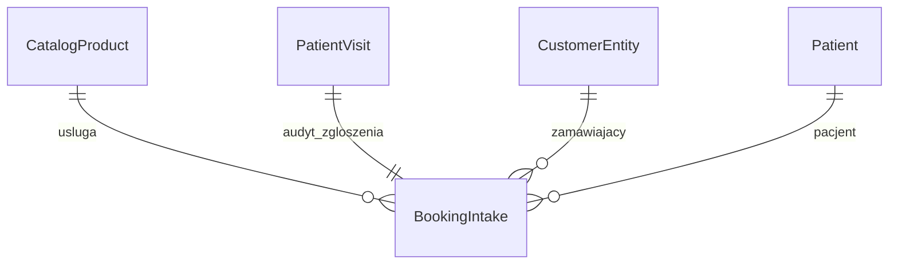

# Publiczna strona rezerwacji wizyt

**Date**: 2026-10-01
**Status**: Ready for implementation
**Spec ID**: PBOOK

## TLDR

Nowy, app-owned moduł `public_booking` dodaje publiczną, niewymagającą logowania stronę Polany Przygody — wizualnie zgodną z `https://polanaprzygody.pl/` (kolory, typografia, nagłówek, stopka; paleta i font przechwycone z żywej strony 2026-10-01, patrz [Reuse and Ownership Map](#reuse-and-ownership-map)) — z cennikiem czytanym z `catalog` (łącznie z ceną promocyjną, jeśli zdefiniowana) oraz przepływem rezerwacji: wybór terapeuty realizującego usługę → wybór wolnego terminu w stylu Cal.com/Calendly → formularz danych i zgód → strona podziękowania. Katalog usług zyskuje trzy nowe pola przez mechanizm custom fields (czas trwania, przypisani terapeuci, przypisane gabinety) — to one zasilają wybór terapeuty i filtr dostępności. Zgłoszenie od razu tworzy normalny rekord `patient:patient_visit` (status `planned`, niepotwierdzony), z gabinetem dobranym automatycznie przez system z listy przypisanej do usługi; dopasowanie klienta (`customers`) i pacjenta (`patient`) odbywa się bez duplikatów po e-mailu/telefonie i imieniu/nazwisku. Po potwierdzeniu wizyty przez rejestrację (istniejąca akcja `confirm` z VIS, zdarzenie `patient.visit.confirmed` już emitowane) nowy subskrybent wysyła e-mail z datą, godziną i gabinetem wizyty.

Decyzje architektoniczne zamknięte zleceniem użytkownika 2026-10-01: jedna łączna specyfikacja (nie dzielimy na katalog + rezerwację), nowy moduł `public_booking`, wizyta publiczna powstaje od razu jako `planned`, gabinet wybierany automatycznie. Dwie dodatkowe decyzje odkryte podczas projektowania (adres pacjenta w formularzu, tożsamość techniczna wykonująca zapis) zatwierdzone przez zamawiającego 2026-10-01 — patrz [Resolved assumptions](#resolved-assumptions).

## Resolved assumptions

Poniższe nie blokowały napisania tej specyfikacji (mają jednoznaczne, odwracalne rozstrzygnięcie) i zostały jawnie zatwierdzone przez zamawiającego 2026-10-01 — każda zmienia widoczny kształt produktu lub tożsamość techniczną wykonującą zapis.

**A — Adres pacjenta w formularzu publicznym. Zatwierdzone: dodajemy pole.** `patient.patients.create` (PAT) wymaga co najmniej jednego aktywnego adresu pacjenta (`PAT`, reguła 2: „Pacjent ma... co najmniej jeden aktywny adres”). Brief nie wymienia adresu wśród pól formularza. Przyjęty domyślny wariant: formularz rezerwacji dokłada **jeden, kompaktowy blok adresu** (ulica i numer, kod pocztowy, miasto; kraj domyślnie `PL`) w sekcji „Dla kogo jest wizyta”, opisany jako potrzebny do kartoteki pacjenta — to jedyne pole w formularzu wykraczające poza literalną listę z briefu. Odrzucona alternatywa: zapisywać placeholder adresu, żeby nie pytać — oznaczałoby fałszowanie danych kartoteki, co jest niezgodne z duchem PAT (zero pretensji do kompletności, której nie ma).

**⚠ B — Tożsamość techniczna wykonująca zapis.** `patient.visits.create` jawnie i celowo sprawdza uprawnienie `patient.visits.manage` oraz wymaga zalogowanego aktora wewnątrz samej komendy (`requireReferenceFeature`/`requireActorUserId` w `src/modules/patient/commands/visits.ts:775-784`, z komentarzem „Every command reaches its own guard: `makeCrudRoute` only covers the HTTP caller, and a command bus caller... bypasses that”) — zgodnie z projektem VIS, które nigdy nie miało anonimowego wejścia. Dodatkowo, jako defense-in-depth, re-sprawdza dostęp do każdego referowanego modułu: `staff.view` zawsze, `resources.view` gdy podany jest gabinet (PBOOK zawsze go podaje — auto-wybór), `catalog.products.view` gdy podana jest usługa (PBOOK zawsze podaje jedną) — `requireCreateReferenceFeatures`, `src/modules/patient/commands/visits.ts:553-561`. Publiczny route **nie** może więc wywołać tej komendy bez żadnej tożsamości, a flaga `ctx.systemActor` platformy jest explicite zarezerwowana dla wywołań nie-HTTP (CLI/subskrybent/worker) — jej komentarz w `CommandRuntimeContext` zabrania ustawiania jej ze ścieżki HTTP, właśnie żeby dowolny anonimowy request nie mógł się podszyć pod uprzywilejowanego aktora.

Rozstrzygnięcie: **dedykowany klucz API** (`api_keys`, moduł już włączony) z rolą ograniczoną do dokładnie sześciu features — `patient.visits.manage`, `patient.patients.manage`, `customers.people.manage` (zapis) plus `staff.view`, `resources.view`, `catalog.products.view` (odczyt referencji, wymagany przez re-check powyżej) — w tenancie/organizacji Polany. Jawnie wykluczone: `patient.visits.override_conflict`, jakiekolwiek `*.manage` na `staff`/`resources`/`catalog`, dostęp do diagnoz/dokumentacji klinicznej.

**Zatwierdzone 2026-10-01: moduł prowizjonuje ten klucz sam, bez ręcznego kroku operatora.** `public_booking/setup.ts` jest idempotentny (ten sam wzorzec „fixture key → upsert, nigdy duplikat” co `polana_bootstrap`): jeśli zgoda/klucz już istnieją w scope, nic nie robi; w przeciwnym razie (1) tworzy dedykowane konto serwisowe `auth.User` (stabilny fixture e-mail, bez logowania interaktywnego, bez hasła użytkowego), (2) tworzy `Role` z dokładnie sześcioma features powyżej i przypisuje je temu kontu, (3) generuje kryptograficznie losowy sekret i woła tę samą, istniejącą ścieżkę tworzenia klucza co `/backend/config/api-keys` (sekret jest hashowany bcryptem w `api_keys_*`, jak każdy inny klucz — zero nowej kryptografii), z `createdBy` = konto serwisowe (stąd `auth.userId` jest realnym UUID, patrz poprawka niżej), (4) przed pierwszym zapisem materializuje deklarowane mapy szyfrowania `public_booking` dla wszystkich istniejących tenantów, a następnie zapisuje jednorazowy plaintext sekretu we **własnej, szyfrowanej encji** `public_booking:service_credential`. Publiczny route czyta sekret z tej encji, konstruuje wewnętrzny `Request` z nagłówkiem `x-api-key` i przekazuje go do eksportowanego `resolveAuthFromRequestDetailed(request)`; nie importuje prywatnego `resolveApiKeyAuth`. Zwrócony `AuthContext` jest przekazywany jako `ctx.auth` do `commandBus.execute(...)`. Cache autoryzacji kluczy oznacza, że unieważnienie może być widoczne z opóźnieniem do około 30 sekund, chyba że ścieżka administracyjna jawnie unieważni cache. **To nie jest jednolicie „ta sama, w pełni egzekwowana ścieżka RBAC” dla wszystkich trzech komend** — zweryfikowane bezpośrednio w kodzie: `patient.visits.create` faktycznie sam sprawdza RBAC (powyżej); `patient.patients.create` i `customers.people.create` **nie mają własnej wewnętrznej kontroli features** — ich ACL żyje wyłącznie w metadanych `makeCrudRoute` HTTP route'a, które `commandBus.execute` z definicji obchodzi. Dla tych dwóch komend przyznanie `patient.patients.manage`/`customers.people.manage` kluczowi jest więc **deklaracją najmniejszych uprawnień i marginesem bezpieczeństwa na przyszłość**, nie dzisiejszym, wymuszanym przez nie warunkiem.

Dwa dodatkowe, drobne poprawki po stronie wykonania, odkryte przy weryfikacji kodu:
- **`clientRequestId` musi być UUID.** Walidatory `patient.visits.create` i `patient.patients.create` wymagają `clientRequestId: z.string().uuid()` (`src/modules/patient/data/validators.ts`), a publiczny nagłówek `Idempotency-Key` (wzorem `checkout`) jest dowolnym 16–128-znakowym ciągiem. Route musi wyliczyć deterministyczny UUID z nagłówka — standardowy, RFC 4122 **UUIDv5** (hash + ustalony namespace aplikacji), osobno przestrzenny per wywoływana komenda (np. namespace `idempotencyKey + ':patient.visits.create'` vs `+ ':patient.patients.create'`), żeby dwa różne wywołania z tego samego nagłówka nigdy nie kolidowały. To nie jest „ad hoc crypto” — to standardowa, publiczna funkcja hashująca do identyfikatora, nie szyfrowanie.
- **ID aktora z klucza API nie jest UUID.** Wynik `resolveAuthFromRequestDetailed` dla klucza API ustawia `auth.sub = 'api_key:<recordId>'` (nigdy goły UUID), a `requireActorUserId` w `src/modules/patient/lib/commandSupport.ts:49` czyta właśnie `ctx.auth?.sub` i wpisuje go do kolumn typu `uuid`. `AuthContext` niesie jednak opcjonalny `userId = record.createdBy`, realny UUID, dla nie-sesyjnego klucza API. Rozwiązanie: (1) klucz musi być utworzony przez dedykowane konto serwisowe; (2) app-owned `patient` zmienia `requireActorUserId` addytywnie na `ctx.runAs?.actorUserId ?? ctx.auth?.userId ?? ctx.auth?.sub ?? null`.

Obie główne decyzje (A, B) są poniżej już wplecione w model/architekturę; zmiana odpowiedzi zmienia tylko lokalny fragment, nie przebudowuje specyfikacji.

## Problem Statement

Polana Przygody prowadzi publiczną stronę marketingową (`polanaprzygody.pl`) z cennikiem (`/cennik`), ale nie ma żadnej możliwości samodzielnej rezerwacji online — klient musi zadzwonić lub napisać, a rejestracja ręcznie szuka wolnego terminu w aplikacji. Jednocześnie ta aplikacja ma już kompletny model wizyty (VIS) i silnik dostępności/konfliktów terapeuty i gabinetu (VCAL, `src/modules/patient/lib/patientAvailabilityService.ts`), dostępne wyłącznie z zalogowanego `/backend`. Katalog usług (`catalog`, zasiany przez `polana_bootstrap`) ma ceny i opisy, ale nie wie, który terapeuta realizuje którą usługę, w jakim gabinecie i jak długo ona trwa — bez tej wiedzy nic nie da się publicznie zaproponować do rezerwacji.

Źródło: brief użytkownika 2026-10-01; zdecydowane 2026-10-01: jedna specyfikacja, nowy moduł, wizyta tworzona od razu, gabinet automatyczny. Referencje wizualne/treściowe przechwycone 2026-10-01 z `https://polanaprzygody.pl/`, `/cennik`, `/regulamin-swiadczenia-uslug`, `/polityka-prywatnosci`. Istniejący, zaimplementowany kod: [PAT](2026-09-29-patient-ehr-base.md), [VIS](2026-09-29-patient-visits.md), [VCAL](2026-09-30-patient-visits-calendar-and-availability.md), `src/modules/patient/`. Wzorzec publicznego, nieautoryzowanego zapisu już istnieje w zainstalowanym `checkout` (`node_modules/@open-mercato/checkout/src/modules/checkout/api/pay/[slug]/submit/route.ts`) i jest podstawą hardeningu niżej.

## Overview and Success Measures

- **Primary outcome:** odwiedzający `polanaprzygody.pl`-podobną publiczną stronę może samodzielnie, bez telefonu, umówić się na usługę z cennika i dostać e-mail z potwierdzeniem po akceptacji przez rejestrację.
- **Leading indicators:** odsetek wizyt zakładanych publicznie vs. telefonicznie; odsetek publicznych zgłoszeń kończących się 409 (slot zajęty w międzyczasie); odsetek zgłoszeń dopasowanych do istniejącego klienta/pacjenta bez duplikatu; zero wizyt utworzonych z nieaktywnym terapeutą/gabinetem.
- **Baseline:** 0 — dziś brak jakiejkolwiek publicznej rezerwacji; cały ruch idzie telefonicznie/mailowo.
- **Market / product reference:** sprawdzone 2026-10-01. [Cal.com](https://github.com/calcom/cal.com) — publiczna strona rezerwacji adresowana po identyfikatorze usługi/hosta, slot = dostępność minus rezerwacje, krok „kto rezerwuje” na końcu. Przyjmujemy ten układ (usługa → osoba → slot → dane), odrzucamy jego multi-host round-robin i płatne dodatki, bo Polana ma jedną usługę na zgłoszenie i jednego terapeutę. [Calendly](https://calendly.com) — siatka dni z panelem slotów po prawej, bez przeładowania strony; przyjmujemy ten layout do makiety 04. Oba serwisy wymagają potwierdzenia zgód przed wysłaniem — przyjmujemy to 1:1 dla regulaminu i polityki prywatności Polany.

## Goals

| ID | Wynik |
|---|---|
| PBOOK-R01 | Publiczna strona (bez logowania) z layoutem zgodnym wizualnie z polanaprzygody.pl (fonty, kolory, logo, nagłówek, stopka) |
| PBOOK-R02 | Strona cennika czytająca usługi i ceny z `catalog`, z ceną promocyjną gdy zdefiniowana |
| PBOOK-R03 | Rozszerzenie `catalog_product` o czas trwania, przypisanych terapeutów i przypisane gabinety |
| PBOOK-R04 | Przepływ „Umów się”: wybór terapeuty realizującego usługę → wybór wolnego terminu uwzględniającego terapeutę, czas trwania i (automatycznie) gabinet |
| PBOOK-R05 | Formularz zgłoszenia (zamawiający, pacjent, zgody) zapisujący wizytę bez duplikowania klienta/pacjenta |
| PBOOK-R06 | Strona podziękowania po wysłaniu zgłoszenia |
| PBOOK-R07 | E-mail z potwierdzeniem (data, godzina, gabinet) wysyłany po potwierdzeniu wizyty przez rejestrację |
| PBOOK-R08 | Publiczny zapis odporny na nadużycia i wyścigi: rate-limit, idempotencja, fail-closed przy niepewnej dostępności, brak przecieku danych innych pacjentów |

## Non-goals

Płatności online za wizytę, konto/logowanie pacjenta (portal `customer_accounts`), samoobsługowe odwoływanie/przenoszenie wizyty, SMS, wersja wielojęzyczna strony publicznej (tylko `pl`), CAPTCHA w pierwszej iteracji (tylko rate-limit; rewizja jeśli nie wystarczy), wiele usług w jednym publicznym zgłoszeniu, wybór gabinetu przez pacjenta, drag-and-drop, synchronizacja z Google/Outlook, zmiana istniejącego kontraktu `patient.visits.create`/`patient.patients.create`/`customers.people.create`.

## Proposed Solution

Cztery warstwy w nowym, app-owned module `src/modules/public_booking/`, każda z jednym właścicielem, reużywające wyłącznie zainstalowane/app-owned prymitywy:

1. **Rozszerzenie katalogu** — trzy nowe definicje custom fields na `catalog:catalog_product`: `booking_duration_minutes` (integer), `booking_team_member_ids` (relation, multi → `staff:staff_team_member`) i `booking_resource_ids` (relation, multi → `resources:resources_resource`). Oba pola relacyjne deklarują jawny `optionsUrl` do `/api/entities/relations/options?entityId=<encoded entity id>`, więc istniejący `CrudForm` obsługuje je bez własnego renderera. Instalacja idempotentnie wpisuje wartości wszystkich ośmiu usług z jawnej mapy SKU poniżej; personel może później je edytować.
2. **Publiczne strony** (`frontend/*`, `requireAuth: false`, wzorzec `checkout/frontend/pay/[slug]`): wspólny layout z nagłówkiem/stopką/paletą Polany, `/cennik` czytająca ceny przez `catalogPricingService`, `/umow-sie/[productId]` — trzykrokowy wizard (terapeuta → termin → dane), `/umow-sie/dziekujemy`.
3. **Zapis** — jeden publiczny endpoint zapisu orkiestrujący dopasowanie/utworzenie klienta i pacjenta, ponowną walidację dostępności, utworzenie wizyty oraz audyt zgód. Wszystkie wywołania cross-module idą przez `commandBus.execute`, z `ctx.auth` z eksportowanego `resolveAuthFromRequestDetailed` dla wewnętrznego requestu `x-api-key`. Zero ORM relacji między modułami.
4. **E-mail potwierdzający** — nowy subskrybent na już istniejące zdarzenie `patient.visit.confirmed`, wzorowany na `checkout`owym `session-started-email.ts` + worker + szablon React-email, wysyłający przez `sendEmail()`/`channel_resend`/`channel_ses`, ale tylko gdy dla `visitId` istnieje rekord `booking_intake` (czyli wizyta pochodzi z publicznego zgłoszenia — staffowe wizyty się nie zmieniają).

### Design Decisions and Alternatives

| Decyzja | Powód | Alternatywa | Dlaczego odrzucona |
|---|---|---|---|
| Nowy moduł `public_booking`, nie rozszerzenie `patient` | Publiczna strona marketingowa + orkiestracja cross-module to inna zdolność niż zarządzanie kartoteką; `patient` zostaje czyste, blast radius nowej, internet-facing powierzchni jest izolowany | Dodać `frontend/*`+API do `patient` | Miesza publiczny, nieautoryzowany kod z modułem noszącym dane kliniczne; trudniejszy przegląd bezpieczeństwa |
| Custom fields (UMES) na `catalog_product`, nie nowe tabele łączące | Brief literalnie prosi o „rozszerzenie modułu katalog o pola dodatkowe”; to już sprawdzony szew (`polana_bootstrap`) | Osobne tabele `service_therapist_link`/`service_resource_link` w `public_booking` | Pole `relation` z kanonicznym `optionsUrl` jest wspierane przez istniejący `CrudForm`; nowa tabela dublowałaby ten mechanizm |
| Gabinet wybierany automatycznie (serwer, pierwszy wolny z listy usługi) | Decyzja użytkownika Q4; brief nie wspomina wyboru gabinetu przez pacjenta | Trzeci krok z wyborem gabinetu | Dodatkowe tarcie bez korzyści dla pacjenta, który i tak nie rozróżnia gabinetów |
| Publiczne zgłoszenie od razu = `patient_visit` `planned` | Decyzja użytkownika Q3 | Osobny rekord „prośby” recenzowany przed utworzeniem wizyty | Odrzucone przez użytkownika; dodatkowo dublowałoby model VIS |
| Dedykowany klucz API (`api_keys`) jako tożsamość zapisu | Jedyny sposób wywołać `patient.visits.create`/`patient.patients.create` bez zmiany ich kontraktu; w pełni audytowalny i odwracalny | Rozluźnić komendy o tryb bezaktorowy / użyć `ctx.systemActor` | Zmiana chronionego kontraktu lub nadużycie flagi explicite zakazanej dla ścieżek HTTP |
| Zasięg (tenant/org) wyprowadzony z klucza API, nie z osobnej zmiennej środowiskowej | Jedna zmienna konfiguracyjna rządzi „czy włączone” i „dla kogo”; brak ryzyka rozjazdu dwóch źródeł prawdy | Osobne `PUBLIC_BOOKING_TENANT_ID`/`ORGANIZATION_ID` | Dwa miejsca mogłyby się rozjechać; brak klucza już oznacza fail-closed |
| Harden publicznego zapisu wzorem `checkout` (Idempotency-Key, Origin/Host, rate-limit `fail-closed`) | Sprawdzony, zainstalowany mechanizm (`@open-mercato/shared/lib/ratelimit`), nie nowy, ad hoc | Własny rate-limiter/nonce | Zakaz ad hoc cache/queue z AGENTS.md; drugi, niemutualizowany mechanizm do utrzymania |
| Dostępność publiczna = tylko sloty z zero konfliktów (żadnych ostrzeżeń) | Publiczny użytkownik nie ma uprawnień ani kontekstu, by świadomie nadpisać ostrzeżenie VCAL | Pokazywać sloty z ostrzeżeniem i prosić o potwierdzenie | VCAL wymaga `patient.visits.override_conflict`, którego klucz API świadomie nie dostaje — nadpisanie zostaje wyłącznie operacją personelu |
| Zdegradowana dostępność = fail-closed (brak rezerwacji, komunikat z telefonem) | Anonimowy użytkownik nie ma zdolności osądu, którą VCAL zakłada dla operatora przy `availability_unknown` | Przyjąć zgłoszenie i zweryfikować później | Mogłoby utworzyć wizytę kolidującą z nieobecnością, którą nikt nie zweryfikuje przed terminem |

## Domain Vocabulary and Business Rules

| Termin / niezmiennik | Znaczenie | Źródło prawdy | Zachowanie przy naruszeniu |
|---|---|---|---|
| Usługa rezerwowalna online | `catalog_product` aktywny, z wypełnionym `booking_duration_minutes`, co najmniej jednym aktywnym terapeutą w `booking_team_member_ids` i co najmniej jednym aktywnym gabinetem w `booking_resource_ids` | `catalog` + custom fields | Usługa bez kompletu pól nie pojawia się z aktywnym przyciskiem „Umów się” na `/cennik` |
| Cena publiczna | Rozwiązana przez `catalogPricingService.resolvePriceMany` dla kontekstu bez klienta/kanału; jeśli wybrana cena ma `priceKind.isPromotion=true`, dodatkowo pokazuje się cena `kind='regular'` jako przekreślona „była” | `catalog_product_prices` + `catalog_price_kinds` | Brak aktywnej ceny ⇒ usługa niepokazywana na cenniku (nie `0 zł`) |
| Wolny slot | Przedział `[start, start+duration)` w strefie placówki, w którym terapeuta ma zero konfliktów VCAL (żadnej wagi — blokującej, ostrzegawczej ani informacyjnej) **i** istnieje ≥1 aktywny gabinet z `booking_resource_ids` usługi bez konfliktu w tym samym przedziale | `patientAvailabilityService` (VCAL) + `catalog_product.booking_resource_ids` | Brak takiego gabinetu ⇒ slot niepokazywany, nawet jeśli terapeuta jest wolny |
| Auto-wybór gabinetu | Pierwszy (po `position`/id) wolny, aktywny gabinet z listy usługi dla wybranego slotu; nigdy pokazywany pacjentowi, widoczny tylko w mailu i w panelu rejestracji | Serwer, w momencie zapisu | Brak wolnego gabinetu ⇒ slot nie był pokazany; wyścig na zapisie ⇒ 409, patrz Edge Cases |
| Dopasowanie klienta | Istniejący `customers:customer_entity` (`kind='person'`) z tym samym znormalizowanym e-mailem **lub** telefonem w tym samym tenant/org | `customers_entities` (odczyt skalarny) | Brak dopasowania ⇒ `customers.people.create`; dopasowanie po tylko jednym z dwóch kanałów nie scala dwóch różnych, już istniejących klientów — tylko decyduje, czy tworzyć nowego |
| Dopasowanie pacjenta | Dla dopasowanego klienta: istniejący `patient:patient` połączony przez `PatientContactLink.customerEntityId`, o tym samym znormalizowanym imieniu i nazwisku (case/diakrytyki-insensitive) | `patient_contact_links` + `patient_patients` | Brak dopasowania ⇒ nowy `patient.patients.create` z `contacts:[{customerEntityId, isContact:true, isPayer:true, isPrimaryContact:true}]`. **Dopasowanie niejednoznaczne** (więcej niż jeden pacjent tego klienta ma to samo znormalizowane imię i nazwisko — rodzeństwo/bliźnięta) ⇒ system **nigdy nie zgaduje**: traktuje to jak brak dopasowania i tworzy nowego pacjenta. Ryzykiem jest wtedy ewentualny duplikat karty, nie zapis wizyty do złej, cudzej kartoteki klinicznej — asymetria świadoma i pożądana |
| Zgłoszenie publiczne | `public_booking:booking_intake` — audyt jednego zapisu: kto zgłosił, jakie zgody, do jakiej wizyty | `public_booking_intakes` | Jeden na wizytę (`unique visit_id`); brak wpływu na stan samej wizyty |
| Wysłanie e-maila potwierdzającego | Reakcja na `patient.visit.confirmed`, tylko gdy istnieje `booking_intake.visit_id = event.id` | subskrybent `public_booking` | Wizyty utworzone w `/backend` (bez intake) nigdy nie wywołują tego e-maila |

**Reguły:**

1. Slot musi zaczynać się co najmniej `MIN_LEAD_TIME_MINUTES` (domyślnie 120 minut) od „teraz” w strefie placówki — nie da się publicznie umówić wizyty za 5 minut, której nikt w rejestracji nie zdąży zobaczyć.
2. Zakres wyszukiwania terminów to najbliższe 60 dni (ta sama granica co VCAL dla widoku miesiąca); dalsze terminy wymagają kontaktu telefonicznego.
3. Slot jest liczony na siatce 15-minutowej; usługa o czasie trwania niepodzielnym przez 15 min nadal startuje na siatce 15-minutowej (koniec wypada wtedy poza siatką, co jest akceptowalne — slot i tak jest sprawdzany dokładnym przedziałem).
4. Jeśli `patientAvailabilityService` zwróci `unknown` (moduł `planner` wyłączony lub odczyt reguł zawiódł) dla wybranego terapeuty, publiczny endpoint **nie** proponuje żadnego slotu dla niego i strona pokazuje komunikat o tymczasowej niedostępności z numerem telefonu — nigdy nie zakłada, że brak danych znaczy „wolne”.
5. Ten sam `Idempotency-Key` wysłany dwa razy z tym samym payloadem zwraca ten samo zgłoszenie (bez drugiego zapisu); z innym payloadem — 409. Klucz jest też używany jako deterministyczny `clientRequestId` dla wewnętrznego wywołania `patient.visits.create`, więc idempotencja działa na obu warstwach konsekwentnie.
6. Checkboxy regulaminu i polityki prywatności są oba wymagane; brak któregokolwiek odrzuca zgłoszenie z 400, bez częściowego zapisu.
7. Dopasowanie klienta/pacjenta nigdy nie nadpisuje istniejących danych (np. innego adresu już w kartotece) — tworzy tylko to, czego nie ma; zgodnie z regułą PAT, dane rodzica/zamawiającego można świadomie dopisać, ale nie zastępują już wpisanych danych pacjenta.
8. Każda nowo odwołana referencja (`teamMemberId`, `resourceId`, `productId`) musi być aktywna w chwili zapisu; serwer sprawdza to ponownie, niezależnie od tego, co pokazywał slot-picker.

## Users, Permissions, and Scope

| Aktor | Dozwolone wyniki | Zasada zakresu | Uprawnienia |
|---|---|---|---|
| Anonimowy odwiedzający | Odczyt cennika/terapeutów/dostępności; wysłanie jednego zgłoszenia rezerwacji | Wyłącznie jeden, skonfigurowany tenant/organizacja Polany — wyprowadzony z klucza API, nigdy z payloadu | brak (publiczne, `requireAuth:false`); ograniczone rate-limitem per IP |
| Klucz API `public_booking` | Tworzenie klienta/pacjenta/wizyty w imieniu zgłoszenia, wyłącznie po stronie serwera | tenant/org własny klucza, przypisanego do dedykowanego konta serwisowego (żeby `auth.userId` było realnym UUID — patrz decyzja B) | `patient.visits.manage`, `patient.patients.manage`, `customers.people.manage`, `staff.view`, `resources.view`, `catalog.products.view` — nic więcej (bez `visits.override_conflict`, bez `*.manage` na `staff`/`resources`/`catalog`, bez diagnoz) |
| Rejestracja / planista | Istniejące działania VIS/VCAL, teraz dodatkowo: potwierdzenie wizyty wywołuje e-mail do zgłaszającego; widzi znacznik „Zarezerwowano online” i zgody na karcie wizyty | własna organizacja | istniejące `patient.visits.view/manage` — bez nowej funkcji |

`tenantId`/`organizationId` dla każdego publicznego żądania pochodzą wyłącznie z `AuthContext` zwróconego przez `resolveAuthFromRequestDetailed` dla wewnętrznego requestu `x-api-key`, nigdy z publicznego nagłówka, query czy body. Brak poprawnego klucza ⇒ cała publiczna powierzchnia renderuje stan „rezerwacja online niedostępna” — fail closed.

## Reuse and Ownership Map

| Zdolność | Reuse / extend / app-own | Moduł | Szew integracji | Dlaczego |
|---|---|---|---|---|
| Ceny i katalog | reuse | `catalog` | `catalogPricingService.resolvePriceMany` | Jedno źródło prawdy o cenie/promocji |
| Czas trwania, terapeuci, gabinety usługi | extend (UMES custom fields) | `catalog` | `ensureCustomFieldDefinitions` na `catalog:catalog_product`, `kind:'integer'`/`kind:'relation'` | Ten sam szew co `polana_bootstrap`; brak nowej tabeli |
| Terapeuci (profil publiczny) | reuse | `staff` | Odczyt skalarny `staff_team_member` + już przechwycone pola bio/foto z `polana_bootstrap` (REQ-001A) | Dane terapeutów już istnieją |
| Dostępność terapeuty i gabinetu | reuse | `patient` (VCAL) + `planner`/`resources` pod spodem | `patientAvailabilityService` (DI token), rozwiązywany przez `container.resolve` z nowego modułu | Jeden silnik konfliktów dla panelu i dla publicznej strony — zero rozjazdu |
| Dopasowanie/utworzenie klienta | extend (nowa logika) + reuse (zapis) | `customers` | Odczyt skalarny `customer_entities` (nowa normalizacja e-mail/telefon, wzorem `check-phone/route.ts`) + `commandBus.execute('customers.people.create', …)` | Brak istniejącego find-or-create do reużycia; zapis nadal przez oficjalną komendę. `personCreateSchema` nie ma pola idempotencji (zweryfikowane: brak `clientRequestId`) — retry-bezpieczeństwo tego kroku pochodzi wyłącznie z odczytu-przed-zapisem (dedup), nie z komendy |
| Dopasowanie/utworzenie pacjenta + powiązanie z klientem | extend (nowa logika) + reuse (zapis) | `patient` | Odczyt `patient_contact_links`/`patient_patients` + `commandBus.execute('patient.patients.create', { contacts:[...] })` | `contacts[]` już atomowo tworzy `PatientContactLink` w tej samej transakcji (PAT „Opiekunowie przy zakładaniu karty”) |
| Utworzenie wizyty | reuse | `patient` (VIS) | `commandBus.execute('patient.visits.create', …)` z `ctx.auth` z klucza API | Zero duplikacji modelu wizyty; wszystkie reguły VIS/VCAL działają bez zmian |
| Potwierdzenie i zdarzenie | reuse | `patient` (VIS) | Istniejąca akcja `confirm`, istniejące zdarzenie `patient.visit.confirmed` | Zero zmian w `patient` |
| Tożsamość zapisu | reuse (mechanizm) + app-own (prowizjonowanie) | `api_keys` + `public_booking` | wewnętrzny `Request` z `x-api-key` → `resolveAuthFromRequestDetailed` → `ctx.auth`; klucz/konto/rola samo-prowizjonowane idempotentnie | Eksportowana ścieżka auth, zero ręcznego kroku operatora |
| Rate limit / idempotencja / hardening publicznego route | reuse (wzorzec) | `@open-mercato/shared/lib/ratelimit`, nagłówek `Idempotency-Key`, walidacja Origin/Host | Kopiuje wzorzec `checkout/api/pay/[slug]/submit/route.ts`, nie kod 1:1 (inny moduł) | Sprawdzony, zainstalowany mechanizm |
| Wysyłka e-maila | reuse | `sendEmail()`, `channel_resend`/`channel_ses`, kolejka workera | Subskrybent + worker + szablon React-email, wzorem `checkout`owego `session-started-email.ts` | Jedyny sprawdzony sposób „e-mail na zdarzenie” w tym repo |
| Publiczna strona / layout / paleta | app-own | `public_booking` | `frontend/**`, `requireAuth:false`, lokalny `theme.css` ze zmiennymi `--pp-*` | Nowa, izolowana powierzchnia; nie zmienia tokenów backendowego design systemu |
| Audyt zgłoszenia i zgód | app-own | `public_booking` | Nowa encja `public_booking:booking_intake` | Dane zgody (treść/czas akceptacji) nie należą do `patient`; nie zaśmieca jego kontraktu |

Brak nowych zależności npm; `api_keys`, `catalog`, `customers`, `patient`, `staff`, `resources`, `planner`, `notifications`, `channel_resend`, `channel_ses`, `communication_channels` są już włączone w `src/modules.ts`.

## Architecture and Data Flow

```text
Publiczny odwiedzający (brak loginu)
  │ GET /cennik, /umow-sie/[productId]
  ▼
public_booking/frontend/**  (requireAuth:false)
  │ fetch same-origin
  ▼
public_booking/api/public/**
  ├─ GET services            → catalogPricingService.resolvePriceMany + custom fields (duration/team/resources)
  ├─ GET services/:id/therapists → staff_team_member aktywni z booking_team_member_ids
  ├─ GET availability        → container.resolve('patientAvailabilityService')  [VCAL, reuse]
  │                              ∩ booking_resource_ids usługi, zero-konfliktowe sloty, siatka 15 min, lead time 120 min
  └─ POST requests  (Idempotency-Key, rate-limit fail-closed, Origin/Host check — wzorem checkout)
        │ const secret = await readOwnServiceCredential(em, scope)   ← self-prowizjonowane przez setup, nie .env
        │ const auth = (await resolveAuthFromRequestDetailed(new Request(internalUrl, { headers: { 'x-api-key': secret } }))).auth
        │ const patientsReqId = uuidv5(`${idempotencyKey}:patient.patients.create`, PBOOK_NAMESPACE)
        │ const visitReqId    = uuidv5(`${idempotencyKey}:patient.visits.create`, PBOOK_NAMESPACE)      ← clientRequestId musi być UUID, patrz decyzja B
        │ 1) dopasuj/utwórz klienta   → commandBus.execute('customers.people.create', …, { auth })  [tylko gdy brak dopasowania; brak idempotencji własnej komendy, patrz Reuse Map]
        │ 2) dopasuj/utwórz pacjenta  → commandBus.execute('patient.patients.create', { contacts:[...], clientRequestId: patientsReqId }, { auth })  [tylko gdy brak dopasowania; dopasowanie niejednoznaczne traktowane jak brak]
        │ 3) przelicz dostępność ponownie, serwerowo, wybierz wolny gabinet
        │ 4) commandBus.execute('patient.visits.create', { patientId, teamMemberId, resourceId, startsAt, endsAt, timeZone, serviceProductIds:[productId], clientRequestId: visitReqId }, { auth })
        │ 5) commandBus.execute('public_booking.intake.record', { visitId, consentProof, snapshots, clientIdempotencyKey: idempotencyKey }, { auth })
        ▼
      commit → zdarzenie public_booking.intake.submitted (bez PII) → strona podziękowania
...
patient.visit.confirmed (istniejące, emitowane przez akcję confirm w /backend)
  ▼
public_booking/subscribers/visit-confirmed-email.ts
  │ czy istnieje booking_intake.visit_id = event.id?  — nie → no-op
  ▼ tak
  enqueue (kolejka public-booking-email) → worker → sendEmail(react: BookingConfirmedEmail({...}))
```

- **Granice modułów:** `public_booking` nigdy nie pisze bezpośrednio do tabel `customers`/`patient`/`catalog` — wyłącznie przez `commandBus` (zapis) albo odczyt skalarny po ID w swoim własnym scope (dostępność, dopasowanie). Zero ORM relacji cross-module.
- **Zasięg bez sesji:** `tenantId`/`organizationId` pochodzą z `resolveAuthFromRequestDetailed`, nie z payloadu/nagłówka/query. Brak/nieprawidłowy klucz ⇒ stan niedostępności (fail closed). Unieważnienie respektuje cache auth (do około 30 s), co pokrywa test z kontrolowanym zegarem lub jawną invalidacją.
- **Zachowanie przy degradacji:** brak modułu `planner` lub błąd odczytu dostępności ⇒ zero slotów proponowanych dla terapeuty (nie „wszystko wolne”); publiczny formularz pokazuje numer telefonu. To odwrotność zachowania VCAL dla personelu (gdzie degradacja jest widoczna, ale nie blokuje) — uzasadnione w Design Decisions, bo tu nikt nie ocenia ostrzeżenia ręcznie.
- **Kompatybilność:** zero zmian w kontraktach `patient.visits.create`/`patient.patients.create`/`customers.people.create`/`patient.visit.confirmed`. Jedyna zmiana widoczna z zewnątrz modułu `catalog` to trzy nowe, addytywne definicje custom fields.

## User Journeys

**PBOOK-J1 — Szczęśliwa ścieżka, nowy klient.** Odwiedzający trafia na `/cennik`, widzi „Diagnoza logopedyczna — 60 min — 249 zł (promocja, była 300 zł)”, klika „Umów się”, wybiera terapeutkę Annę Nowicką, wybiera wtorek 10:00, wypełnia dane swoje i dziecka, zaznacza dwie zgody, wysyła. Widzi stronę podziękowania. Po akceptacji terminu przez rejestrację w `/backend` dostaje e-mail z datą, godziną i nazwą gabinetu.

**PBOOK-J2 — Istniejący klient, nowy pacjent.** Ten sam rodzic wraca za miesiąc, umawia drugie dziecko na inną usługę. System rozpoznaje go po e-mailu/telefonie (dane w formularzu nie są automatycznie wypełniane — widoczny jest tylko neutralny komunikat po stronie serwera w logach/audycie), tworzy tylko nowego pacjenta powiązanego z tym samym klientem, bez duplikowania osoby zgłaszającej.

**PBOOK-J3 — Brak wolnych terminów.** Wybrany terapeuta nie ma żadnego wolnego slotu w najbliższych 60 dniach dla tej usługi (urlop, pełny grafik). Strona pokazuje „Brak wolnych terminów — wybierz innego terapeutę lub zadzwoń” zamiast pustej siatki.

**PBOOK-J4 — Wyścig na slocie.** Dwóch odwiedzających wybiera ten sam slot. Pierwszy wysyła formularz i wygrywa. Drugi dostaje 409 dopiero na etapie wysyłki (serwer przelicza dostępność ponownie przed zapisem) — formularz zachowuje wpisane dane, slot-picker odświeża listę i usuwa zajęty termin.

**PBOOK-J5 — Zdegradowana dostępność.** Moduł `planner` jest tymczasowo wyłączony/padnięty. Strona `/umow-sie/[id]` nie proponuje żadnego terminu i pokazuje numer telefonu zamiast zgadywać.

**PBOOK-J6 — Nadużycie.** Skrypt wysyła dziesiątki zgłoszeń z jednego IP w minutę. Po przekroczeniu limitu endpoint zwraca 429 z czytelnym komunikatem; limiter niedostępny (degradacja infrastruktury) ⇒ 503, nigdy „przepuść niezliczone”.

## UI and Interaction Contracts

Layout publiczny ma własny, lokalny zestaw tokenów (`--pp-primary:#2A5C47`, `--pp-primary-dark:#1E4435`, `--pp-accent:#E8FC59`, `--pp-tint:#EFF1C5`, `--pp-sage:#BCC7A1`; font `Jost` z Google Fonts) — przechwycone 2026-10-01 z żywego `theme-color` i skompilowanego CSS strony referencyjnej. Te tokeny żyją wyłącznie w `public_booking/frontend/theme.css`, zaaplikowanym tylko w publicznym layoucie; nie nadpisują i nie mieszają się z tokenami statusów backendowego design systemu (`StatusBadge` itd. w panelu rejestracji zostają bez zmian).

| Powierzchnia / trasa | Cel i akcje | Źródło / mutacje | Komponenty | Wymagane stany |
|---|---|---|---|---|
| `/` | Wspólny layout, hero, link do cennika | statyczna treść | `PublicLayout`, hero | — |
| `/cennik` | Lista usług z katalogu, cena (+ promocja), „Umów się” tylko dla usług rezerwowalnych online | `GET /api/public/booking/services` | karty usług, `badge-promo` | loading, empty (brak usług rezerwowalnych), error |
| `/umow-sie/[productId]` krok 1 | Wybór terapeuty przypisanego do usługi | `GET /api/public/booking/services/:id/therapists` | karty terapeuty (zdjęcie/bio z `staff`) | loading, empty (usługa bez terapeuty → 404 z powrotem do cennika) |
| `/umow-sie/[productId]` krok 2 | Siatka dni + lista slotów wybranego dnia (Cal.com/Calendly) | `GET /api/public/booking/availability` | pasek dni, lista slotów, debounce przy zmianie dnia | loading, brak slotów w dniu, brak slotów w zakresie, zdegradowane |
| `/umow-sie/[productId]` krok 3 | Dane zamawiającego, dane i adres pacjenta, dwie zgody | `POST /api/public/booking/requests` | formularz, checkboxy zgód z linkami do regulaminu/polityki | walidacja, 409 (slot zajęty → powrót do kroku 2 z zachowanymi danymi), 429, 503 |
| `/umow-sie/dziekujemy` | Podziękowanie, informacja o mailu | brak | komunikat sukcesu | — |
| `/backend/patient/visits/[id]` (istniejąca strona VIS/VCAL) | Dodany, tylko-odczytowy panel „Zarezerwowano online” z czasem zgłoszenia i statusem zgód | odczyt skalarny `booking_intake` po `visitId` | mały panel/`pill` w istniejącej karcie | brak intake (wizyta staffowa) → panel niewidoczny |

Makiety (dokument projektowy, nie implementacja — wygląd docelowy powstaje z realnych komponentów i tokenów, nie z tego HTML-a): [`assets/pbook-ui-mockups.html`](assets/pbook-ui-mockups.html), render: `node .ai/specs/assets/render-pbook-mockups.mjs`. **Uwaga wykonawcza:** w środowisku, w którym pisana jest ta specyfikacja, brakuje systemowych bibliotek Playwright/Chromium (`libnspr4.so` i pokrewne) — PNG nie zostały wyrenderowane tutaj; skrypt jest gotowy i działa w środowisku z zainstalowanymi zależnościami przeglądarki (CI lub stacja deweloperska z `yarn playwright install-deps`).

| # | Ekran | Co pokazuje |
|---|---|---|
| 01 | Layout publiczny | Nagłówek, nawigacja, hero, stopka z godzinami/kontaktem/dokumentami — paleta i treść nagłówka/stopki 1:1 z przechwyconymi faktami |
| 02 | Cennik | Karty usług, cena bazowa vs. promocyjna (przekreślona+badge), usługa bez kompletu pól bez aktywnego CTA |
| 03 | Krok 1 — terapeuta | Karty terapeutów przypisanych do usługi, zaznaczony wybór |
| 04 | Krok 2 — kalendarz | Pasek dni + lista slotów, slot zajęty/nieobecność wyszarzony |
| 05 | Krok 3 — formularz | Zamawiający, pacjent + adres, dwie zgody z linkami |
| 06 | Podziękowanie | Komunikat sukcesu i informacja o mailu |
| 07 | Degradacja | Rezerwacja wstrzymana, numer telefonu |
| 08 | Konflikt 409 | Slot zajęty tuż przed wysłaniem, dane zachowane |
| 09 | Zbiór stanów | loading/empty/walidacja/429/rozpoznany klient/duplikat |
| 10 | 360 px | Cennik i krok formularza na wąskim ekranie |
| 11 | Panel backendowy | Znacznik „Zarezerwowano online” na karcie wizyty VIS |

**Dostępność i responsywność:** każdy krok wizarda ma widoczny, czytnikowy nagłówek kroku (`aria-current="step"`); zmiana wyniku sprawdzania dostępności ogłaszana `aria-live="polite"`; pole telefonu/e-mail z `inputmode` odpowiednim do klawiatury mobilnej; na ≤768 px pasek dni przewija się horyzontalnie bez utraty fokusu; formularz zachowuje wpisane wartości po każdym błędzie serwera. Brak JSON/UUID widocznych użytkownikowi.

**Lokalizacja:** przestrzeń `publicBooking.*` w `pl` (jedyny język w tej iteracji, patrz Non-goals); teksty prawne linkowane jako zewnętrzne URL-e Polany, nie kopiowane do bazy.

## Data Models

Nowa encja w `public_booking`; brak zmian schematu w `patient`/`customers`. Trzy nowe definicje custom fields na `catalog:catalog_product` (wartości, nie kolumny).



### Custom fields na `catalog:catalog_product`

| Klucz | `kind` | `configJson` | Reguła |
|---|---|---|---|
| `booking_duration_minutes` | `integer` | — | Wymagane, żeby usługa była rezerwowalna online; > 0, ≤ 480 |
| `booking_team_member_ids` | `relation` | `{ relatedEntityId: 'staff:staff_team_member', multi: true, optionsUrl: '/api/entities/relations/options?entityId=staff%3Astaff_team_member' }` | Co najmniej jeden aktywny wpis, żeby usługa była rezerwowalna online |
| `booking_resource_ids` | `relation` | `{ relatedEntityId: 'resources:resources_resource', multi: true, optionsUrl: '/api/entities/relations/options?entityId=resources%3Aresources_resource' }` | Co najmniej jeden aktywny wpis, żeby usługa była rezerwowalna online |

Rejestrowane przez `ensureCustomFieldDefinitions(...)` w `public_booking/setup.ts`. Po zasianiu katalogu, terapeutów i zasobów `polana_bootstrap` rozwiązuje identyfikatory wyłącznie po stabilnych `sourceId`/`key` i zapisuje poniższą, wersjonowaną mapę. Brak choć jednej referencji jest błędem setupu dla danego SKU — nigdy nie podstawiamy „wszystkich terapeutów” ani „wszystkich gabinetów”. Ponowne uruchomienie aktualizuje dokładnie te trzy wartości, nie tworzy duplikatów i nie przekracza scope. Późniejsze edycje personelu pozostają dozwolone; kolejny jawnie uruchomiony seed przywraca deklarowany stan instalacyjny.

| SKU | `booking_duration_minutes` | Therapist fixture `sourceId` | Resource fixture `key` |
|---|---:|---|---|
| `PP-DIAG-SI` | 60 | `joanna-wieczorek`, `barbara-kowalczyk` | `sala-si` |
| `PP-DIAG-LOG` | 60 | `elzbieta-sokolowska`, `aleksandra-nowakowska` | `gabinet-logopedy`, `gabinet-neurologopedii` |
| `PP-DIAG-PSY` | 60 | `barbara-kowalczyk` | `gabinet-psychologa` |
| `PP-TER-LOG` | 50 | `elzbieta-sokolowska`, `aleksandra-nowakowska` | `gabinet-logopedy`, `gabinet-neurologopedii` |
| `PP-REDIAG-LOG` | 50 | `elzbieta-sokolowska`, `aleksandra-nowakowska` | `gabinet-logopedy`, `gabinet-neurologopedii` |
| `PP-TER-SI` | 50 | `joanna-wieczorek`, `barbara-kowalczyk` | `sala-si` |
| `PP-TUS` | 60 | `joanna-wieczorek`, `barbara-kowalczyk` | `sala-si` |
| `PP-KONS-PSY` | 50 | `barbara-kowalczyk` | `gabinet-psychologa` |

### `BookingIntake` — `public_booking_intakes`, `public_booking:booking_intake`

| Pole | Typ / null | Reguła |
|---|---|---|
| `visit_id` | uuid, required, unique per scope | Scalar `patient:patient_visit`; jeden intake na wizytę |
| `customer_entity_id` | uuid, required | Scalar `customers:customer_entity` |
| `patient_id` | uuid, required | Scalar `patient:patient` |
| `product_id` | uuid, required | Scalar `catalog:catalog_product` (usługa zgłoszenia) |
| `requester_name_snapshot` | text, required, szyfrowane | Imię i nazwisko zamawiającego w chwili zgłoszenia |
| `requester_email_snapshot` | text, nullable, szyfrowane | — |
| `requester_phone_snapshot` | text, required, szyfrowane | — |
| `consent_proof` | text, required, szyfrowane | Zserializowane `{ terms:{url,acceptedAt}, privacyPolicy:{url,acceptedAt} }`; ciphertext nie jest przeszukiwany jak JSON — bez hashu treści: dokumenty są zewnętrzne (hostowane przez Polanę), nie kopiowane do bazy, w przeciwieństwie do `checkout`owego `buildConsentProof`, który haszuje własną, lokalnie przechowywaną treść |
| `client_idempotency_key` | text, required, unique per scope | Wartość nagłówka `Idempotency-Key` |
| `request_payload_hash` | text(64), required | SHA-256 kanonicznego requestu; ten sam klucz + inny hash ⇒ 409, bez deszyfrowania PII |
| `submitted_at` | timestamptz, required | Serwer |
| `confirmation_email_sent_at` | timestamptz, nullable | Trwały marker idempotencji e-maila potwierdzającego; ustawiany dopiero po sukcesie wysyłki |
| pola wspólne | `tenant_id`, `organization_id`, `id`, `created_at`, `updated_at`, `deleted_at` | Standard |

Brak cross-module FK/kaskad. Zapisywana przez nową, małą komendę `public_booking.intake.record` (patrz API), żeby mieć pojedynczy, testowalny punkt zapisu z własną idempotencją — nie bezpośredni `em.persist` z route'a.

### `ServiceCredential` — `public_booking_service_credentials`, `public_booking:service_credential`

| Pole | Typ / null | Reguła |
|---|---|---|
| `service_user_id` | uuid, required | Scalar `auth:user` — dedykowane konto serwisowe utworzone przez setup |
| `api_key_id` | uuid, required | Scalar `api_keys:api_key` |
| `api_key_secret` | text, required, szyfrowane | Jedyna kopia plaintext sekretu; odczytywana wyłącznie przez route publicznego zapisu |
| pola wspólne | `tenant_id`, `organization_id`, `id`, `created_at`, `updated_at` | Jedna żywa krotka per scope; setup jest idempotentny (upsert po scope, nie po wartości) |

Tworzona i czytana wyłącznie przez `public_booking/setup.ts` i `public_booking/lib/serviceCredential.ts`. Setup najpierw rejestruje i materializuje mapę szyfrowania dla każdego istniejącego tenanta, dopiero potem zapisuje sekret. Żaden route/UI nie wystawia sekretu. Usunięcie credentialu/konta odcina zapis po wygaśnięciu cache auth (maksymalnie około 30 s), chyba że operacja administracyjna wywoła invalidację.

## API, Command, and Error Contracts

Wszystkie trasy pod `src/modules/public_booking/api/public/**`, `requireAuth: false`, per-method `metadata`+`openApi`.

| Metoda / ścieżka | Payload / query | Zachowanie | Błędy |
|---|---|---|---|
| GET `/api/public/booking/services` | — | Lista usług rezerwowalnych online: `{id,title,description,durationMinutes,category,price:{currency,amount,wasAmount?,isPromotion}}` | 503 jeśli klucz API nieskonfigurowany/nieprawidłowy |
| GET `/api/public/booking/services/:id/therapists` | — | `{id,displayName,photoUrl?,shortBio?,specializations?}[]`, tylko aktywni, tylko z `booking_team_member_ids` tej usługi | 404 jeśli usługa nie jest rezerwowalna online |
| GET `/api/public/booking/availability` | `productId`, `teamMemberId`, `from`, `to` (≤60 dni) | `{slots:[{startsAt,endsAt,timeZone}]}` — zero-konfliktowe, auto-gabinet nieujawniany | 422 nieprawidłowe parametry/zakres; 200 z `degraded:true, slots:[]` gdy `planner` wyłączony/odczyt zawiódł (R04 reguła 4) |
| POST `/api/public/booking/requests` | Nagłówek `Idempotency-Key` (16–128 znaków, wymagany). Body: `{productId,teamMemberId,startsAt,endsAt,timeZone, requester:{firstName,lastName,email?,phone}, patient:{firstName,lastName,address:{street,postalCode,city,country}}, consents:{terms:true,privacyPolicy:true}}` | Orkiestracja z Architecture; 201 `{ok:true}` (bez ID/PII w odpowiedzi — strona podziękowania nie potrzebuje więcej) | 400 walidacja/brak zgód; 404 usługa/terapeuta nieaktywny; 409 slot już zajęty **lub** powtórzony `Idempotency-Key` z innym payloadem; 422 slot poza regułami (lead time, zakres, konflikt); 429 rate limit; 503 klucz API/limiter niedostępny |

Nowa, mała komenda `public_booking.intake.record` (`isUndoable:false`) — wywoływana wyłącznie z route'a POST, zapisuje `BookingIntake`, idempotentna po `client_idempotency_key`. Reużyte komendy (bez zmian kontraktu): `customers.people.create`, `patient.patients.create`, `patient.visits.create`.

Harden POST wzorem `checkout/api/pay/[slug]/submit/route.ts`: walidacja Origin/Host przeciw podstawionemu nagłówkowi, rate limit `@open-mercato/shared/lib/ratelimit` w namespace `public-booking-submit`, posture `fail-closed` (niedostępny limiter ⇒ 503, nie przepuszczenie). GET-y używają lżejszego, `fail-open` limitu w namespace `public-booking-read` (zniechęca scraping bez ryzyka fałszywych 503 dla zwykłego ruchu).

## Events, Jobs, Notifications, and Cross-Module Flows

Nowe: `public_booking.intake.submitted` (`{id,visitId,tenantId,organizationId,createdAt}`, bez PII) po sukcesie całej orkiestracji. Konsumowane (nie emitowane): `patient.visit.confirmed` (istniejące, z `patient`).

Nowy subskrybent `public_booking/subscribers/visit-confirmed-email.ts`: na `patient.visit.confirmed`, odczytuje `BookingIntake` po `visitId`; brak rekordu ⇒ no-op (wizyta staffowa). Gdy jest, wzywa `dispatchBookingEmailJob({ visitId, tenantId, organizationId })` → kolejka `public-booking-email` (`createQueue`, wzorem `checkout`) → worker `workers/send-email.worker.ts` ładuje wizytę (data/godzina/gabinet, odczyt skalarny `patient:patient_visit`) i `BookingIntake` (adres e-mail zamawiającego), renderuje `emails/BookingConfirmedEmail.tsx` (React-email, wzorem `PaymentStartEmail.tsx`), wywołuje `sendEmail({ to, subject, react: BookingConfirmedEmail({...}), tenantId, organizationId })`. Brak treści klinicznej w mailu — tylko usługa, data, godzina, nazwa gabinetu, adres placówki.

Brak jobs/schedulerów poza tą jedną kolejką e-mail. Efekty indeksu/cache po commit, zgodnie ze standardem.

## Security, Privacy, and Compliance

- Publiczna powierzchnia nigdy nie przyjmuje `tenantId`/`organizationId`/`actorId` z payloadu; zasięg wyłącznie z rozwiązanego klucza API, fail closed przy jego braku/nieprawidłowości.
- Klucz API ograniczony do sześciu, jawnie wymienionych features (3 zapis + 3 odczyt referencji, patrz decyzja B) — bez `patient.visits.override_conflict`, bez dostępu do danych klinicznych/diagnoz, bez uprawnień zapisu w `staff`/`resources`/`catalog`. Klucz jest samo-prowizjonowany przez `public_booking/setup.ts` (konto serwisowe + rola + klucz + encja `service_credential`, idempotentnie) — nie wymaga operatora wklejającego sekret do `.env`. Odwołanie dostępu = usunięcie wiersza `service_credential` albo konta serwisowego (można też z poziomu istniejącego `/backend/config/api-keys`), bez wdrożenia.
- Direct `commandBus.execute` z publicznego route'a obchodzi warstwę ACL HTTP (`requireFeatures` żyje w `makeCrudRoute`, nie w komendzie) — to ten sam, sankcjonowany wzorzec, co publiczny `checkout`owy submit; route sam jest granicą autoryzacji i musi (i poniżej ma) własny rate-limit, walidację Origin/Host i ponowną, serwerową walidację dostępności przed każdym wywołaniem komendy. Dla `patient.visits.create` ten re-check jest też egzekwowany wewnątrz samej komendy (zweryfikowane w kodzie); dla `patient.patients.create`/`customers.people.create` dziś nie — klucz dostaje te features jako margines bezpieczeństwa, nie bo są dziś sprawdzane (patrz decyzja B i Risks).
- `BookingIntake` ma własną mapę szyfrowania (`public_booking/encryption.ts`) dla snapshotów zamawiającego i dowodu zgód — ten sam wzorzec co `patient/encryption.ts`. Logi i zdarzenia nie zawierają PII (tylko ID/liczniki).
- Rate limit na zapisie jest `fail-closed` (niedostępny limiter ⇒ 503, nie przepuszczenie) — nieograniczony publiczny zapis byłby gorszy niż chwilowa niedostępność. Odczyty są `fail-open` (degradacja limitera nie blokuje przeglądania cennika).
- `Idempotency-Key` zapobiega podwójnemu zapisowi przy retry/timeout sieciowym; nie jest sekretem i nie jest traktowany jako dowód tożsamości.
- Adres pacjenta zbierany w formularzu trafia do tego samego szyfrowania co resztę kartoteki PAT — nie jest nowym, słabiej chronionym kanałem.
- Zero nowych uprawnień dla personelu; panel „Zarezerwowano online” jest tylko-odczytowy i gated istniejącym `patient.visits.view`.

## Integration Coverage

Docelowe samowystarczalne pliki `src/modules/public_booking/__integration__/PBOOK-Txx.spec.ts`, każdy tworzący własny scope/fixtures, bez zależności od danych Polany.

| Test | Akcja | Oracle | Requirements |
|---|---|---|---|
| PBOOK-T00 | Rejestracja trzech definicji custom fields; `optionsUrl` relacji; zapis wartości poza zakresem/ze złą referencją | Definicje istnieją raz po dwukrotnym setupie; `CrudForm` ładuje scoped opcje; walidacja odrzuca >480 min i nieaktywne referencje | R03 |
| PBOOK-T00A | Świeża instalacja i ponowny seed w jednym oraz drugim scope | Każdy z 8 SKU ma dokładnie deklarowany czas, fixture IDs terapeutów i gabinetów; rerun nie duplikuje, brak „all records” fallbacku ani cross-scope IDs | R03 |
| PBOOK-T01 | GET services z usługami kompletnymi/niekompletnymi/z i bez promocji | Tylko kompletne usługi, poprawna cena bazowa/promocyjna | R02/R03 |
| PBOOK-T02 | GET therapists dla usługi z aktywnymi/nieaktywnymi terapeutami | Tylko aktywni, poprawne pola publiczne | R03/R04 |
| PBOOK-T03 | GET availability: terapeuta z grafikiem/bez grafiku/z urlopem/z zajętym gabinetem/wszystkie gabinety usługi zajęte | Zero-konfliktowe sloty, brak fałszywie wolnych; `degraded:true` gdy planner wyłączony | R04/R08 |
| PBOOK-T04 | POST requests: nowy klient+pacjent; istniejący klient+nowy pacjent; istniejący klient+istniejący pacjent (to samo imię/nazwisko) | Brak duplikatów `customer_entity`/`patient`; poprawny `PatientContactLink` | R05 |
| PBOOK-T05 | POST requests: brak zgody, brak telefonu, brak pól pacjenta | 400, zero zapisu częściowego | R05 |
| PBOOK-T06 | POST requests: dwa równoległe żądania na ten sam slot | Jeden sukces, drugi 409, brak podwójnej rezerwacji gabinetu/terapeuty | R04/R08 |
| PBOOK-T07 | POST requests: ten sam `Idempotency-Key` dwa razy (ten sam payload / inny payload) | Ten sam wynik / 409 | R08 |
| PBOOK-T08 | POST requests: rate limit przekroczony; limiter niedostępny | 429 / 503, zero zapisu | R08 |
| PBOOK-T09 | `patient.visit.confirmed` z i bez `BookingIntake` | E-mail wysłany tylko gdy intake istnieje, poprawna treść (data/godzina/gabinet) | R07 |
| PBOOK-T10 | Zły/brak klucz API (np. wiersz `service_credential` usunięty) | Cała publiczna powierzchnia zwraca stan niedostępności, zero zapisu z domyślnym/pierwszym tenantem | R08 |
| PBOOK-T12 | `public_booking/setup.ts` wywołany dwukrotnie w tym samym scope; wywołany w dwóch różnych scope | Jedno konto serwisowe/rola/klucz/`service_credential` per scope, nigdy duplikat; brak wycieku sekretu między scope | R08 |
| PBOOK-T11 | Panel backendowy na wizycie z i bez intake | Znacznik widoczny/niewidoczny, gated `patient.visits.view` | R07 |

## Implementation Phases

### PBOOK-1 — Rozszerzenie katalogu

- **Outcome:** świeża instalacja ma osiem gotowych do rezerwacji usług, a personel może edytować ich czas, terapeutów i gabinety.
- **Steps:** 1) Definicje custom fields z jawnymi `optionsUrl`. 2) Wersjonowana mapa SKU → duration → therapist fixture keys → resource fixture keys, uruchamiana po seedach właścicieli. 3) Testy walidacji, idempotencji i dwóch scope; przegląd round trip istniejącego `CrudForm`.
- **Validation:** `yarn generate && yarn typecheck && yarn lint`; manualna weryfikacja w `/backend/catalog/catalog/products/[id]`; PBOOK-T00/T00A.
- **Exit:** Każdy z ośmiu SKU ma dokładnie wartości z tabeli po świeżej instalacji i drugim uruchomieniu setupu; relacje są edytowalne w istniejącym formularzu.

### PBOOK-2 — Publiczne strony i odczyt (bez zapisu)

- **Depends on:** PBOOK-1.
- **Outcome:** `/`, `/cennik`, krok 1 i 2 wizarda działają w pełni na odczycie; brak jeszcze formularza/zapisu.
- **Steps:** 1) `public_booking` module + `frontend/**` + layout/`theme.css`. 2) GET endpoints (services/therapists/availability), reużycie `catalogPricingService`+`patientAvailabilityService`. 3) UI stany z makiet 01–04, 07, 09 (częściowo), 10.
- **Validation:** `yarn generate && yarn typecheck && yarn lint && yarn ds:check`; PBOOK-T01–T03.
- **Exit:** Publiczny, niezalogowany użytkownik widzi prawdziwy cennik i prawdziwe, zero-konfliktowe sloty wybranego terapeuty.

### PBOOK-3 — Zapis zgłoszenia

- **Depends on:** PBOOK-2. Klucz API nie jest zewnętrzną zależnością — ta faza sama go prowizjonuje (decyzja B).
- **Outcome:** Formularz zapisuje wizytę bez duplikatów, z pełnym hardeningiem.
- **Steps:** 1) Dopasowanie klienta/pacjenta + `BookingIntake`/`ServiceCredential` encje, mapy szyfrowania i komenda `intake.record`. 2) Idempotentne prowizjonowanie konta/roli/klucza po materializacji map szyfrowania; poprawka `requireActorUserId`; UUIDv5; POST route z `resolveAuthFromRequestDetailed`, rate-limit/Idempotency-Key/Origin-Host. 3) Krok 3 wizarda + podziękowanie.
- **Validation:** Pełna bramka; `yarn test:integration:ephemeral` PBOOK-T04–T08/T10.
- **Exit:** Publiczne zgłoszenie tworzy realny `patient_visit`, bez duplikatu klienta/pacjenta, odporne na wyścig i nadużycie.

### PBOOK-4 — Potwierdzenie i e-mail

- **Depends on:** PBOOK-3.
- **Outcome:** Potwierdzenie wizyty w `/backend` wysyła e-mail; rejestracja widzi źródło zgłoszenia.
- **Steps:** 1) Subskrybent + kolejka + worker + szablon React-email. 2) Panel „Zarezerwowano online” w `/backend/patient/visits/[id]` (bezpośrednia, drobna edycja własnego kodu `patient`, nie UMES — moduł jest nasz). 3) Makieta 11.
- **Validation:** Pełna bramka; PBOOK-T09/T11.
- **Exit:** Potwierdzenie wizyty z publicznego zgłoszenia realnie dostarcza e-mail z datą/godziną/gabinetem; wizyty staffowe bez zmian.

## Requirement Traceability

| Requirement | Journey | Model/API | Phase | Tests | Acceptance |
|---|---|---|---|---|---|
| PBOOK-R01 | layout | `frontend/**`, `theme.css` | 2 | manualne UI | AC-01 |
| PBOOK-R02 | J1 | GET services | 2 | T01 | AC-02 |
| PBOOK-R03 | — | custom fields + jawna mapa seedów | 1 | T00/T00A | AC-03 |
| PBOOK-R04 | J1/J3/J4/J5 | GET therapists/availability | 2 | T02/T03 | AC-04 |
| PBOOK-R05 | J1/J2 | POST requests | 3 | T04/T05 | AC-05 |
| PBOOK-R06 | J1 | strona podziękowania | 3 | manualne UI | AC-06 |
| PBOOK-R07 | — | subskrybent/worker | 4 | T09 | AC-07 |
| PBOOK-R08 | J4/J6 | rate-limit/idempotencja/klucz API | 3 | T06/T07/T08/T10/T12 | AC-08 |

## Rollout, Migration, and Rollback

Migracja ograniczona do dwóch nowych tabel (`public_booking_intakes`, `public_booking_service_credentials`) i custom-field definicji na `catalog_product` (brak nowych kolumn na istniejących tabelach `patient`/`customers`/`catalog`). `yarn db:generate`, przegląd SQL/snapshotu, zgoda przed `apply` — zgodnie z AGENTS.md. Przed PBOOK-3: `public_booking/setup.ts` samo-prowizjonuje konto serwisowe, rolę i klucz API przy pierwszym uruchomieniu (zero ręcznego kroku operatora, zero `.env`) — wymaga tylko wgrania drobnej, addytywnej poprawki `requireActorUserId` w `src/modules/patient/lib/commandSupport.ts` (decyzja B). Brak poprawki = publiczny zapis odpada na insercie (uuid), wykryte przez PBOOK-T04 przed wdrożeniem; sam setup jest idempotentny, więc wielokrotny `yarn generate`/restart nie tworzy drugiego konta/klucza.

Rollback: usunąć wiersz `service_credential` albo konto serwisowe i unieważnić cache auth (bez jawnej invalidacji odcięcie nastąpi po TTL, do około 30 s), opcjonalnie wyłączyć moduł `public_booking` w `src/modules.ts`. Istniejące wizyty zostają w `patient`; tabele i addytywne definicje custom fields mogą pozostać bez wpływu na starsze ścieżki.

## Risks and Tradeoffs

| Ryzyko | Wpływ | Ochrona / test | Pozostaje |
|---|---|---|---|
| Relacyjne opcje mogłyby ominąć scope | Cross-tenant wyciek nazw/ID w formularzu | Oba pola deklarują kanoniczny, scoped `optionsUrl`; PBOOK-T00 i browser QA | Ryzyko regresji platformowego endpointu, wykrywane przez test dwóch scope |
| Klucz API o realnych uprawnieniach zapisu, wywoływany przez publiczny endpoint | Błąd w walidacji route'a = potencjalny nieautoryzowany zapis | Minimalny, zweryfikowany w kodzie zestaw features (6, nie 3 — patrz decyzja B), rate-limit fail-closed, ponowna serwerowa walidacja przed każdym zapisem, PBOOK-T10 | Każda przyszła zmiana tego route'a wymaga tego samego przeglądu bezpieczeństwa co `checkout` |
| `patient.patients.create`/`customers.people.create` nie mają własnej kontroli RBAC (tylko HTTP-layer) | Dziś działa tylko dlatego, że klucz API ma i tak właściwe features; przyszła, niezależna zmiana którejś z tych komend mogłaby to po cichu zmienić w obie strony | Klucz API przyznaje features na wyrost (margines bezpieczeństwa), PBOOK-T04 pokrywa realny zapis end-to-end | Brak wewnętrznego re-checku w tych dwóch komendach pozostaje faktem platformy, nie czymś, co ta specyfikacja naprawia |
| Niezgodność typu `clientRequestId` (UUID wymagany) i ID aktora (`api_key:<id>` nie jest UUID) z kontraktem komend VIS/PAT | Bez poprawki publiczny zapis odpada na pierwszym insercie, nie na etapie projektowania | Deterministyczny UUIDv5 z `Idempotency-Key`; drobna, addytywna poprawka `requireActorUserId` na `ctx.auth?.userId ?? ctx.auth?.sub`; oba pokryte PBOOK-T04 | Wymaga, by klucz API był utworzony przez realne konto serwisowe (nie efemeryczną sesję), inaczej `auth.userId` nie istnieje |
| Adres pacjenta zwiększa tarcie formularza | Potencjalnie niższa konwersja | Jedno zwarte pole, jasno opisane; decyzja zatwierdzona 2026-10-01 | Akceptowane, mierzone porzuceniami kroku |
| Dopasowanie klienta po e-mailu/telefonie bez dodatkowej weryfikacji (np. kodu SMS) | Ktoś inny mógłby „rozpoznać” istniejącego klienta podając znany e-mail | Formularz nie ujawnia dopasowania ani nie dogrywa istniejących danych widocznie; dane pacjenta nadal trzeba wpisać; brak SMS-owej weryfikacji to świadomy non-goal tej iteracji | Socjotechniczne ryzyko dopisania się jako nowy pacjent do cudzego konta klienta — do rewizji, jeśli się zmaterializuje |
| Degradacja `planner` chowa wszystkie sloty terapeuty | Pacjent nie umówi się online, nawet gdy terapeuta realnie jest wolny | Jawny komunikat z telefonem (makieta 07); to świadomy wybór bezpieczeństwa, nie błąd | Czasowa utrata kanału rezerwacji przy awarii `planner` |

## Acceptance Criteria

- [ ] **AC-01:** publiczna strona ma nagłówek/stopkę/kolory/font zgodne z przechwyconą paletą polanaprzygody.pl, dostępna bez logowania.
- [ ] **AC-02:** `/cennik` pokazuje tylko usługi rezerwowalne online, z poprawną ceną bazową i promocyjną (gdy zdefiniowana), zasilane realnie z `catalog`.
- [ ] **AC-03:** świeża instalacja idempotentnie ustawia trzy pola dla wszystkich ośmiu SKU dokładnie według jawnej mapy; relacje używają scoped `optionsUrl`, a personel może później edytować wartości w istniejącym formularzu produktu.
- [ ] **AC-04:** slot-picker pokazuje wyłącznie terminy wolne jednocześnie dla terapeuty i co najmniej jednego gabinetu usługi, z zerem ostrzeżeń pokazywanych publicznie.
- [ ] **AC-05:** zgłoszenie tworzy wizytę bez duplikowania istniejącego klienta/pacjenta w żadnym z trzech scenariuszy dopasowania.
- [ ] **AC-06:** po wysłaniu zgłoszenia użytkownik widzi stronę podziękowania z informacją o mailu.
- [ ] **AC-07:** potwierdzenie wizyty w `/backend` wywołuje realny e-mail z datą/godziną/gabinetem, tylko dla wizyt z publicznego zgłoszenia.
- [ ] **AC-08:** rate-limit, idempotencja, samo-prowizjonowanie klucza API i brak/nieprawidłowy klucz działają zgodnie z PBOOK-T06–T08/T10/T12; zero zapisu przy ich naruszeniu.

## Final Compliance Report

| Check | Status | Evidence / resolution |
|---|---|---|
| Applicable `AGENTS.md` files and routed guides/skills reviewed | pass | `AGENTS.md`, spec-delivery and compatibility contract; routed module-data, UMES, backend UI and testing guidance |
| Data models, APIs, events, UI, and tests are internally consistent | pass | PBOOK-R01–R08 map to AC-01–AC-08 and PBOOK-T00–T12 |
| Every workflow completes end to end without a catch-all integration phase | pass | PBOOK-1 operable install, PBOOK-2 reads, PBOOK-3 submission, PBOOK-4 notification/provenance |
| Platform-native reuse and extension points were chosen before custom code | pass | custom fields, command bus, exported auth resolver, queues/events, availability and pricing services |
| UI contracts identify references, canonical components, and theme/state coverage | pass | UI contracts and phase-specific browser evidence |
| Every phase has dependencies, bounded slices, tests, value, and an observable exit gate | pass | PBOOK-1–PBOOK-4 |

**Verdict: Ready for implementation.**

## Open Questions

Brak blokujących pytań. Decyzje A i B zostały zatwierdzone 2026-10-01; symbol ostrzeżenia przy historycznej decyzji B opisuje jej wagę bezpieczeństwa, nie nierozstrzygnięcie. Jawna mapa seedów jest instalacyjnym źródłem prawdy.

## Changelog

| Date | Change |
|---|---|
| 2026-10-01 | Szkielet z bramą Open Questions (Q1–Q4); zamknięty zleceniem użytkownika: jedna specyfikacja, nowy moduł, wizyta od razu, gabinet automatyczny |
| 2026-10-01 | Pełna specyfikacja: architektura, model danych, API, bezpieczeństwo (dedykowany klucz API jako tożsamość zapisu — decyzja B), makiety, fazy, traceability; paleta/font/treść nagłówka-stopki przechwycone z żywej strony referencyjnej |
| 2026-10-01 | Niezależny przegląd architektoniczny (fresh-context agent): 2 Critical + 3 High + 1 Medium — klucz API miał za mało features (brak `staff.view`/`resources.view`/`catalog.products.view` wymaganych przez `patient.visits.create`), ID aktora klucza API (`api_key:<id>`) nie jest typem UUID wymaganym przez kolumny audytowe, `Idempotency-Key` nie jest UUID wymaganym przez `clientRequestId`, `patient.patients.create`/`customers.people.create` nie mają wewnętrznej kontroli RBAC (tylko HTTP-layer), dopasowanie pacjenta po samym imieniu/nazwisku było niejednoznaczne, brak testu integracyjnego dla R03. Wszystkie naprawione: poprawiona lista features, poprawka `requireActorUserId` na `ctx.auth?.userId`, deterministyczny UUIDv5 z nagłówka, jawne „margines bezpieczeństwa, nie dzisiejsza kontrola” dla dwóch komend, reguła „niejednoznaczne = traktuj jak brak”, dodany PBOOK-T00 |
| 2026-10-01 | Zamawiający zatwierdził obie decyzje („Resolved assumptions” A i B); na życzenie zamawiającego klucz API jest teraz **samo-prowizjonowany** przez `public_booking/setup.ts` (konto serwisowe + rola + klucz + nowa szyfrowana encja `public_booking:service_credential`, idempotentnie) — zero ręcznego kroku operatora i zero `.env`; dodany PBOOK-T12 |
| 2026-10-01 | Bramka implementacyjna: dodano jawną mapę seedów wszystkich ośmiu SKU, relacyjne `optionsUrl`, eksportowaną ścieżkę auth, materializację map szyfrowania, semantykę cache/revocation i końcową macierz zgodności |
| 2026-10-01 | Implementacja PBOOK-3: zaszyfrowany dowód zgód jest serializowany do `text` (ciphertext nie jest JSON-em); dodano jawny hash payloadu dla semantyki 409 i trwały marker idempotencji e-maila potwierdzającego |
