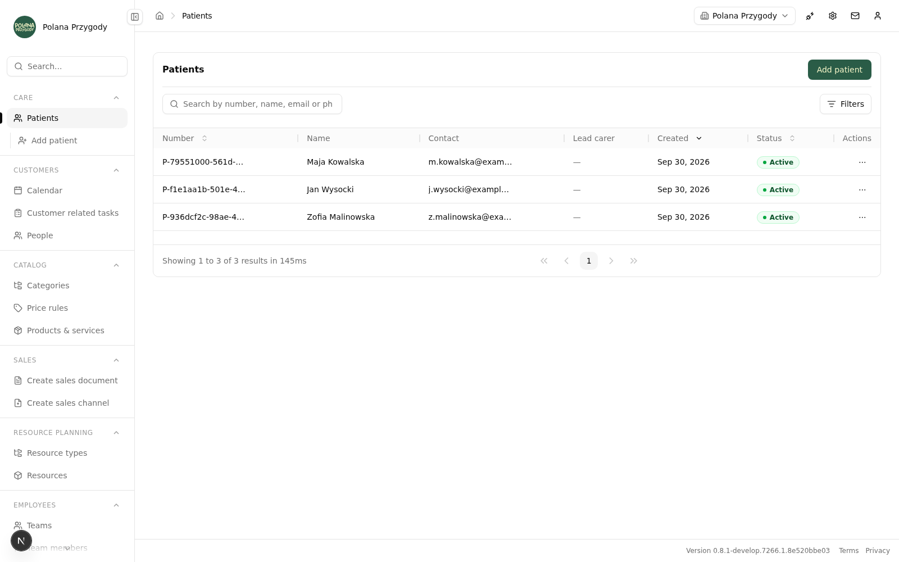
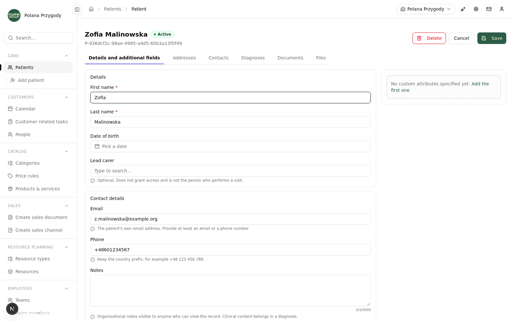
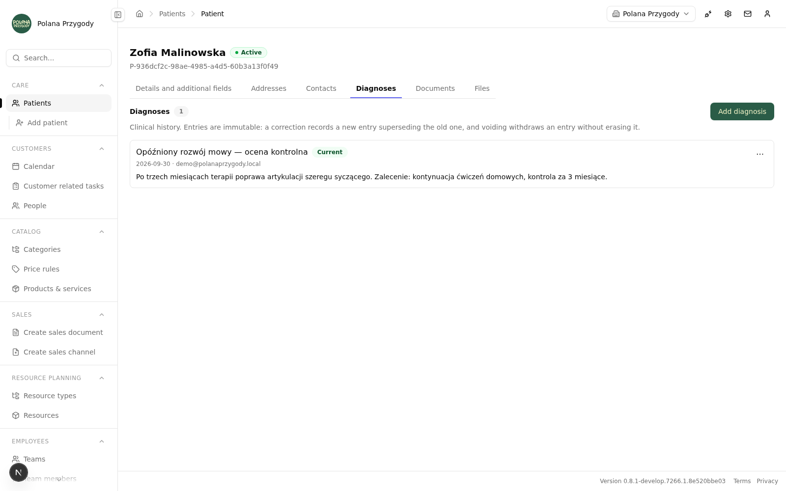
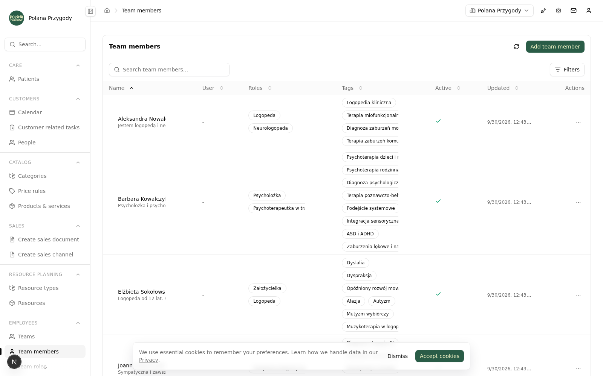

# 🌲 Polana Przygody — eHR

A back-office **electronic health record** for a Polish children's therapy and adventure centre —
patients, guardians, diagnoses, documents, staff and schedules in one place. It is a standalone
[Open Mercato](https://github.com/open-mercato/open-mercato) application — a single Next.js +
MikroORM deployment assembled from the framework's published modules (CRM, catalogue, sales,
staff, planner, resources, documents, attachments, workflows, the AI assistant and more) plus the
modules this repository owns under `src/modules/`.

> 📚 This project is built on **[Open Mercato](https://github.com/open-mercato/open-mercato)** and
> was created as a worked example for the Open Mercato course at
> **[help.openmercatocloud.com](https://help.openmercatocloud.com)**. It is a real, working
> application, not a toy demo — read on for what it actually does and how it is built.

The centre runs its clients, therapists, rooms and schedules here. The newest app-owned module is
the **patient register** (`src/modules/patient/`) — the base of an electronic health record: a
patient's identity, addresses, the people around them, their diagnoses and their documentation.

The UI is Polish. `Pacjenci` is the register, `Prowadzący` is the optional lead carer, `Opiekun` is
a guardian.

> 🔒 **Privacy note.** The staff fixtures shipped in `src/modules/polana_bootstrap/` (names,
> avatars, third-party training references) are fictional placeholders, not real people. No real
> patient or clinical data ever ships in this repository — see
> [Tenant data is encrypted at rest](#tenant-data-is-encrypted-at-rest) for how the app handles
> real data in production.

## 📸 Screenshots

| Patients register | Patient record |
|---|---|
|  |  |

| Diagnosis history | Team members |
|---|---|
|  |  |

All screenshots above are taken from the actual running application with synthetic demo data —
none of it is real patient or staff information.

## 🚀 Getting started

Requires Node ≥ 24, Yarn 4 and PostgreSQL. `docker-compose.yml` brings up Postgres (plus optional
Redis, Meilisearch and LocalStack services) if you do not have a database already.

```bash
cp .env.example .env     # then fill in DATABASE_URL and the secrets
yarn setup               # install, generate registries, initialise the database
yarn dev
```

Open [http://localhost:3000/backend](http://localhost:3000/backend). If you need to create the
first tenant, organisation and admin user by hand, use the framework's setup command:

```bash
yarn mercato auth setup --orgName "Your Org" --email you@example.com --password 'ChangeMe123!'
```

Afterwards, `yarn dev` is the everyday command. Two things are easy to get wrong:

- **Run `yarn generate` after changing any discovery file** — entities, API routes, pages, events,
  widgets, agents, tools, workflows or `src/modules.ts`. The registries are generated, not scanned
  at runtime.
- **Restart the dev server after `yarn generate` plus a migration.** ORM metadata and the entity
  table cache are built once per process, so HMR alone leaves a stale registry behind — which
  surfaces as `relation "..." does not exist` against a table that plainly exists.

Schema changes are generated with `yarn db:generate`, reviewed, and only then applied with
`yarn db:migrate`. Never migrate a database just to make a check pass.

## 🗂️ The patient register

A patient here is **not** a CRM record. A child in therapy has no e-mail of their own, no billing
relationship and no sales pipeline, but does have guardians, a payer and clinical history. So the
module owns its own `Patient` entity and refers to CRM people by id, rather than bending the CRM
person into a medical record.

### Creating a record

Identity, the lead carer, the patient's own contact channel, the guardians and the first address
are one atomic write. Guardians entered here are linked in the same transaction as the record and
its first address, so a child never lands in the register separated from the parent who brought
them in.

Picking a guardian offers to fill the patient's **empty** e-mail and phone fields from that person
— it never overwrites something the operator typed, and it does not make the parent's contact
details a live reference. The lead carer option shows the therapist's specialisations, read from
the `staff` module's tags.

### The record

The record opens on its own data plus whatever custom attributes the organisation has defined.
Everything else lives behind a tab: addresses, contacts, diagnoses, documents, files.

Addresses use the same editor and address shape as the CRM, through an adapter onto the patient's
own API. An active record has exactly one primary address, and the switch between two of them is
a single locked, atomic transition.

Contacts are CRM people linked to the patient with independent role flags — guardian, contact
person, payer — so one person can be both the guardian and the payer without being listed twice.
A patient may have none; the same person may be linked to several patients. Unlinking removes the
link, never the CRM record.

Diagnoses are append-only clinical history. An entry's text is immutable once saved: a correction
writes a **new** entry that supersedes the previous one, and a mistake is voided with a reason
rather than deleted. A voided entry stays in the list — still present, still readable, clearly
marked as void.

Documents are the platform's own documents, pinned to the patient or created from the record and
opened in the native editor. Pinning grants nobody access: each document keeps its own owner and
shares, so a document the signed-in user may not open is still listed, without leaking its title.
A document pinned to more than one patient says so.

The files tab is deliberately switched off — see
[Clinical files are refused on purpose](#clinical-files-are-refused-on-purpose).

The dialogs spell out the rules they enforce. Linking a contact states that roles are independent
and that a primary contact requires the contact role — a rule the database enforces with a check
constraint and a partial unique index, not only the form. Adding a diagnosis takes an optional
code, system and version, and says plainly that the code is not validated against any dictionary:
the module records terminology, it does not implement one.

## 🔐 How the module is built

This is the part worth reading if you are here for the engineering rather than the product.

### Tenant data is encrypted at rest

`src/modules/patient/encryption.ts` declares **31 encrypted fields across 6 entities**. Names,
birth date, e-mail, phone, every free-text address line and coordinate, relationship labels,
diagnosis titles, descriptions, codes and void reasons, pinned file names, and the stored
idempotency payloads are all ciphertext in the database.

That decision is paid for on every read path, and the module is explicit about the bill. Ciphertext
cannot be ordered in SQL, so the list sorts by patient number, creation date and status — never by
name. It cannot be matched with a plaintext pattern, so name search works differently (below). And
it must not be written to a file nobody re-encrypts, so the register has no CSV export at all.

Some columns are deliberately left in plaintext, for stated reasons: `patient_number` is a
server-generated `P-<uuid>` that carries no personal data but is the unique key, the default sort
and the exact search handle; `diagnosed_on` is the clinical list's sort and range filter;
statuses, states and role booleans are low-cardinality filters that ciphertext would not actually
hide, since a handful of distinct values is trivially distinguishable by frequency.

Declaring a map is not the same as installing one. `EncryptionMap` rows are materialised when a
tenant is created, so a tenant that predates the module has no `patient:*` map and every sensitive
write fails closed with a 503 rather than silently storing plaintext. The rollout step is
`yarn mercato entities seed-encryption --tenant <id>`, and the refusal message names the entity and
the remedy so the failure is not a dead end.

### Search over encrypted columns

Because the name and contact columns are ciphertext, the list cannot resolve the search box with
`ILIKE`. `resolvePatientSearchIds` in `src/modules/patient/api/patients/route.ts` resolves one
search term through three paths and unions the ids:

1. a substring match on `patient_number`, which is plaintext and safe to match that way;
2. the framework's hashed `search_tokens` index over the encrypted name, e-mail and phone fields;
3. **only when the first two produce nothing**, a bounded decrypt-and-match over the most recent
   page of records.

A surname still narrows the register even though `last_name` is ciphertext in the database — the
term is resolved through the hashed token index, not an `ILIKE` the column could never answer.

The third path exists for one specific moment. Search tokens are written by the query index *after*
the write commits, so between creating a patient and that pipeline catching up the record exists
and is invisible to a search by name — which is exactly when an operator is most likely to look for
it. The fallback is capped, ordered by recency, and runs only on a miss: a bridge over index lag,
not a replacement for the index.

### Concurrency: both locks, in the right order

Every editable record carries `updated_at` as its version token, sent back on update and delete as
`expectedUpdatedAt` or in the framework's `x-om-ext-optimistic-lock-expected-updated-at` header.
A missing token is a 400 and a mismatch is a 409 — two different failures a client handles
differently, so they are never collapsed into one, and a conflict returns the current version so
the UI can offer a reload without discarding what was typed.

The optimistic check alone would not serialise anything, so the first phase inside every write
transaction is a pessimistic `SELECT … FOR UPDATE` on the patient row (`lockPatient` in
`src/modules/patient/lib/commandSupport.ts`), taken *before* the version comparison. Check-then-lock
lets two writers read the same `updated_at`, both pass, and both write. The same aggregate lock is
what makes the primary-address switch and a diagnosis correction atomic, and because every command
takes it on the patient first, the lock order is always patient → child and two commands cannot
deadlock by approaching from opposite ends.

### Archive, don't delete

A record with documentation — diagnoses, documents, pending document intents, files — cannot be
deleted: the command answers *"this record has documentation and cannot be deleted; archive it
instead"*. Archiving stops new entries from being accepted and keeps the whole history readable.
Only an empty record created by mistake can be removed.

### Clinical files are refused on purpose

The files tab ships its model, commands, routes and UI, and then refuses every write with
HTTP **503** and the code `clinical_file_protection_unavailable`.

The reason is written up in full in `src/modules/patient/lib/clinicalFileGate.ts` and verified
against the installed framework version: the attachments module authorises a download by tenant and
organisation scope only. `checkAttachmentAccess` takes no feature list and no parent record, and the
download route calls it directly — so any signed-in user of the organisation who knows an attachment
id could read a patient's clinical file. A patient-scoped download route that checks the clinical
feature would be worth nothing while the host's own URL serves the same bytes, so the module
refuses the feature instead of pretending to protect it. A feature that visibly does not work is
safe; one that looks protected and is not is how clinical data leaks.

The host behaviour is pinned as a deliberately inverted assertion in
`src/modules/patient/__tests__/clinicalFileGate.test.ts`: it asserts what is currently true, so a
host version that fixes it **breaks that test** and forces the phase to be re-evaluated rather than
leaving the gate shut forever. The blocker is filed upstream as
[mercato-sandboxes#563](https://github.com/open-mercato/mercato-sandboxes/issues/563). The single
documented override is the `OM_PATIENT_CLINICAL_FILES_ENABLED` environment flag, default off — an
explicit deployment assertion, because whether the host enforces owner authorisation on routes this
module does not own is not something it can probe.

### Feature-based access control

`src/modules/patient/acl.ts` declares five feature ids with `dependsOn` edges, and every route's
`metadata`, every page's `requireFeatures` and every command guard references one of them. Role
names never appear in a check.

| Feature | Depends on |
|---|---|
| `patient.patients.view` | — |
| `patient.patients.manage` | `patient.patients.view` |
| `patient.clinical.view` | `patient.patients.view` |
| `patient.clinical.manage` | `patient.clinical.view` |
| `patient.configure` | `patient.patients.view` |

The edges carry meaning: the clinical surface depends on being able to see the record, so granting
`patient.patients.*` alone is what makes "registration staff can never reach diagnoses"
enforceable. `patient.configure` is deliberately *not* a parent of the clinical features —
configuring custom-field definitions is not an implicit right to read documentation. Reaching a
document additionally requires the documents module's own permissions and share tier; the patient
link never grants them.

### Scope is derived and fails closed

Tenant and organisation come from the session or API key through the standard request/command
context. Scope keys in a payload are rejected outright. A missing tenant or an unselected
organisation is a refusal, never "all organisations" — the difference between an unscoped read
returning nothing and returning everyone's patients. `created_by_user_id`, `updated_by_user_id` and
a diagnosis author are server-side facts and are never accepted from a client.

## 🧱 Project layout

```
src/modules.ts                 the enabled module set (~60 framework modules + app modules)
src/modules/patient/           the patient register — the app's own EHR base
src/modules/polana_bootstrap/  organisation, catalogue and resource bootstrap for the centre
.ai/specs/                     specifications, each with its implementation status ledger
.ai/guides/                    framework conventions this app is written against
```

Inside `src/modules/patient/` the layout is the framework's standard module shape:

```
data/entities.ts        6 entities, all scoped by (tenant_id, organization_id)
data/validators.ts      request schemas
encryption.ts           the at-rest field maps
acl.ts, setup.ts        feature declarations and grants
commands/               every write, with locking, idempotency and audit
api/                    per-method metadata + openApi on every route
backend/patient/        the register list, create page and record page
components/             tables, forms, tabs and dialogs
lib/                    shared command helpers and the clinical file gate
i18n/                   pl + en catalogues; no hard-coded user strings
migrations/             reviewed, shipped migrations
__tests__/              unit tests
__integration__/        PAT-T01–T12 integration specs
```

`AGENTS.md` is the contributor guide — the conventions, the boundaries between app-owned and
installed modules, and the routing rules for AI agents working in this repository.

## ✅ Validation

```bash
yarn generate && yarn typecheck && yarn lint && yarn ds:check && yarn test && yarn build
```

`yarn ds:check` enforces the design system — semantic tokens instead of palette shades, the
design-system scale instead of arbitrary Tailwind values. `yarn i18n:check-hardcoded` catches
user-facing strings that were never localised. Integration and end-to-end specs run against an
ephemeral environment:

```bash
yarn test:integration:ephemeral
```

## 📋 Status

The patient register is built to the ledger in
[`.ai/specs/2026-09-29-patient-ehr-base.md`](.ai/specs/2026-09-29-patient-ehr-base.md), which is
the authority on what the module does and does not do.

| Phase | State |
|---|---|
| PAT-1 — working register: records, addresses, CRM contacts, custom fields | done |
| PAT-2 — diagnoses and documents, including interrupted-creation recovery | done |
| PAT-3 — clinical files | blocked on the host capability described above |

Every action in the module has been exercised end to end in a browser against the running app and
works: listing, sorting, filtering and searching the register; creating a patient with a guardian;
editing and saving the record; adding, promoting and deleting an address; linking and unlinking a
contact; adding, correcting and voiding a diagnosis; creating and unpinning a document; the files
tab's refusal; archiving and restoring; deleting an empty record — and the 409 that refuses to
delete a record which has documentation. The unit suite and the full validation gate above pass.

One caveat, rather than a green badge: **the PAT-T01–T12 integration specs have been written but
not executed.** They live in `src/modules/patient/__integration__/`, they typecheck and discovery
finds them, but running them needs Docker and integration credentials that were not available. The
manual pass above is not a substitute for them, so do not read them as passing.

### Not yet built

Visits (`VIS`) are specified separately and deliberately out of scope here. The register's
"next visit" column is designed but belongs to that specification, and appears only once visits
ship and only for users who may see them.

The register's non-goals are equally deliberate: no prescriptions, lab results, allergies,
medications or hospitalisation; no PESEL as an identifier; no P1/NFZ integration; no mandatory ICD
dictionary; no FHIR; no patient portal; no OCR or AI over clinical content; no automatic retention
or clinical export. No claim of regulatory compliance is made anywhere in this repository.

## 📄 License

Licensed under the [MIT License](LICENSE).

## 🙏 Credits

Built on [Open Mercato](https://github.com/open-mercato/open-mercato) as a worked example for the
course at [help.openmercatocloud.com](https://help.openmercatocloud.com).
